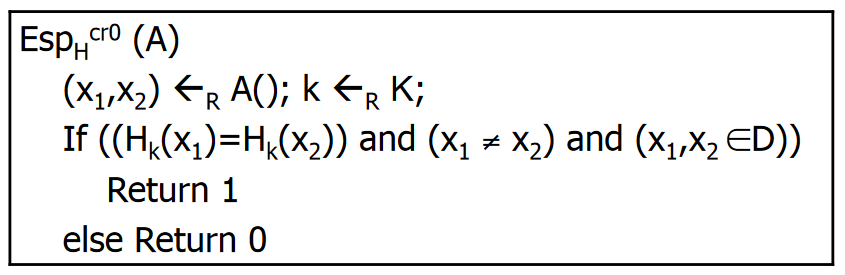
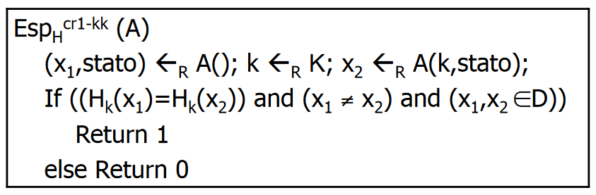
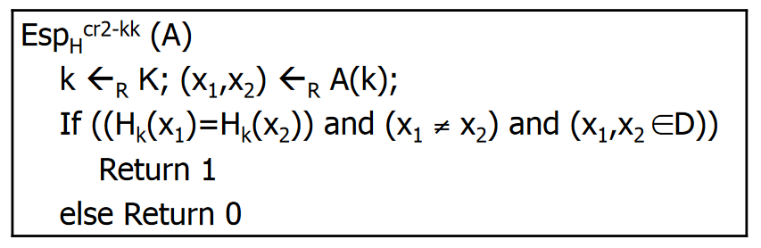
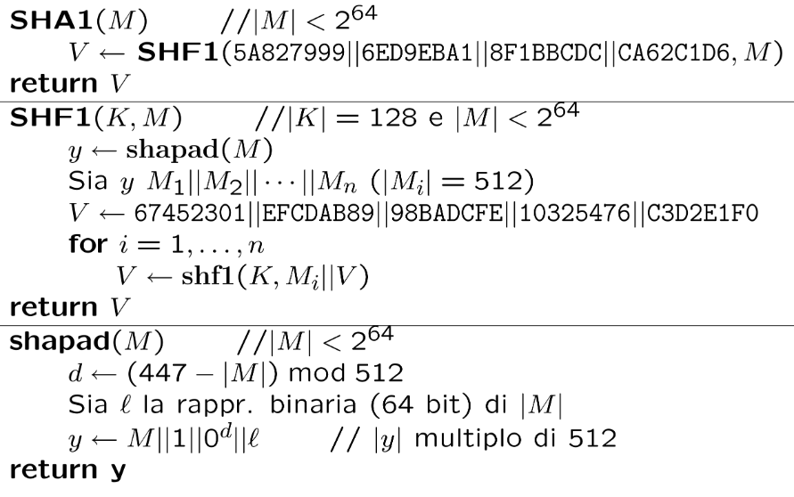
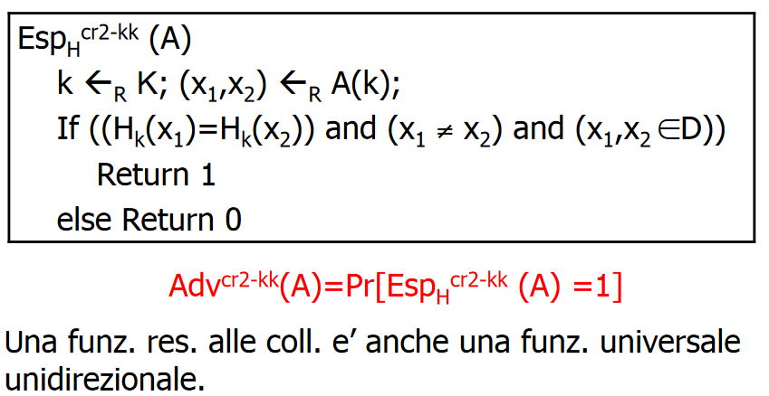
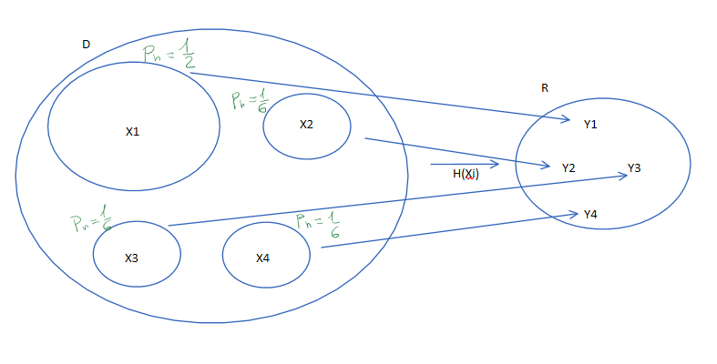
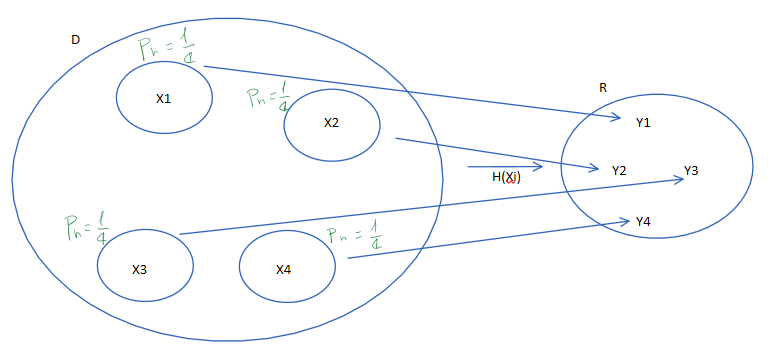

# Funzioni hash

[TOC]

## Introduzione

Una funzione hash è un algoritmo matematico che mappa dei dati di lunghezza arbitraria in una stringa binaria di dimensione fissa chiamata *valore di hash*, ma spesso viene indicata con il termine inglese *message digest* (o semplicemente *digest*). Tale funzione di hash è progettata per essere **unidirezionale**, ovvero una funzione difficile da invertire: l'unico modo per ricreare i dati di input dall'output di una funzione di hash ideale è quello di tentare una ricerca di forza bruta di possibili input per vedere se vi è corrispondenza.

Una funzione hash è, generalmente, una funzione che comprime, ovvero riceve un input di lunghezza arbitraria e restituisce un output di lunghezza fissata. Naturalmente, in ambito crittografico, il dominio e il codominio di queste funzioni devono essere immaginati come illimitati, anche se sappiamo che ciò non può essere vero.

Una funzione hash deve possedere le seguenti proprietà:

- deve identificare univocamente il messaggio, non è possibile che due messaggi differenti, pur essendo simili, abbiano lo stesso valore di hash, questa proprietà prende il nome di **resistenza alle collisioni**;
- deve essere deterministico, in modo che lo stesso messaggio si traduca sempre nello stesso hash, questa proprietà prende il nome di **universalità**;
- deve essere semplice e veloce calcolare il valore hash da un qualunque tipo di dato;
- deve essere molto difficile o quasi impossibile generare un messaggio dal suo valore hash se non provando tutti i messaggi possibili, questa proprietà prende il nome di **unidirezionalità**.

La maggior parte delle funzioni di hash crittografiche è progettata per prendere in input una stringa di qualsiasi lunghezza e produrre in output un valore di hash di lunghezza fissa. Queste funzioni devono essere in grado di resistere a tutti gli attacchi basati sulla crittoanalisi. Iniziamo definendo formalmente una famiglia di funzioni hash.


## Famiglie di funzioni hash

Sia $H: \{0,1\}^k \times D \rightarrow \{0,1\}^n$ una famiglia di funzioni hash. Ogni chiave $k$ definisce una mappa del tipo:
$$
h(x) = H_k(x)
$$
La chiave $k$ a differenza, di quanto visto per i cifrari a blocchi, è resa pubblica.


## Resistenza alle Collisioni

Dati due messaggi $m_1$ ed $m_2$, con $m_1 \neq m_2$, deve essere difficile che i due messaggi abbiano lo stesso hash, quindi con $hash(m_1) = hash(m_2)$. Tale coppia è chiamata collisione di hash crittografica. Questa proprietà a volte è indicata come *forte resistenza alla collisione*. In particolare data una funzione hash $H: D \rightarrow R$, se $|D| \gt |R|$ allora le collisioni sono inevitabili.

$H$ è resistente alle collisioni se è computazionalmente impossibile trovare collisioni. E' sorprendente come tale proprietà sia possibile per funzioni che non limitiamo la dimensione dell'input. Infatti, anche se ci limitassimo a input di 256 bit avremmo un numero enorme di input che collidono, basti pensare al **principio della piccionaia**.

Una piccionaia con $m$ caselle può contenere al più $m$ piccioni, se non se ne vogliono mettere più di uno in nessuna casella: un ulteriore volatile dovrà necessariamente condividere la casella con un suo simile. Formalmente, il principio afferma che se $A$ e $B$ sono due insiemi finiti e $B$ ha cardinalità strettamente minore di $A$, allora non esiste alcuna funzione iniettiva da $A$ a $B$.

**Esempio:**

Sia $H: D \rightarrow R$ una famiglia di funzioni hash con $D = 2^{256}$, che è il numero di piccioni, e $R = 2^{160}$ che è il numero di caselle. Se $H$ è una funzione hash regolare, allora:
$$
\frac{2^{256}}{2^{160}} = 2^{96}
$$
sono gli input medi con lo stesso output.

A questo punto analizziamo 3 diverse nozioni di collisione.


### Definizione: funzioni Universali o quasi Universali

Sia $H: D \rightarrow R$ una famiglia di funzioni hash e sia $A$ un avversario contro la resistenza alle collisioni (**CR**, *collision resistant*). L'avversario è così definito:



Definiamo il vantaggio dell'avversario con la seguente scrittura:
$$
Adv^{cr0}(A) = Pr[Esp_H^{cr0}(A) = 1]
$$
Una funzione si dice universale o quasi universale se il vantaggio per ogni possibile avversario $A$ è prossimo a zero. In questo caso non è importante che $A$ sia un avversario polinomialmente limitato perché la scelta dell'input non dipende dall'effettiva esecuzione dell'algoritmo. Cosa non vera per tutto ciò che è stato visto prima e che vedremo in seguito.

Per prima cosa l'avversario $A$ deve scegliere casualmente una coppia di valori $x_1$ e $x_2$, tale che $x_1 \neq x_2$ e che appartengano all'insieme $D$. Successivamente, utilizzando una certa distribuzione di probabilità $R$, verrà scelta casualmente una chiave $k \in K$, la quale verrà utilizzata per mappare i valori scelti dall'utente. Se accade che $H_k(x_1) = H_k(x_2)$, allora dirà di aver trovato una collisione e restituirà 1, altrimenti restituirà 0, ovvero non ha trovato una collisione.

Il compito richiesto all'avversario $A$ è titanico, in quanto deve scegliere $x_1, x_2$ senza sapere a quale istanza verranno applicate.

**Esempio - informale** 

Supponiamo di dover svolgere un esame e il docente ci dà solo un foglio bianco, senza sapere le domande a cui rispondere. Il nostro compito è quello di provare ad immaginare le possibili domande e trovare una risposta, solo allo scadere del tempo riceveremo le domande e potremmo sapere se una delle nostre risposte è valida. Questo, ovviamente, è un lavoro molto arduo.

Da questo esempio possiamo affermare e banalmente dimostrare che il vantaggio di un qualsiasi avversario è pressoché zero.


### Definizione: funzioni universali unidirezionali

Sia $H: D \rightarrow R$ una famiglia di funzioni hash e sia $A$ un avversario contro la resistenza alle collisioni (**CR1-kk**, *collision resistant - known key*). L'avversario è così definito:



Definiamo il vantaggio dell'avversario con la seguente scrittura:
$$
Adv^{cr1-kk}(A) = Pr[Esp_H^{cr1-kk}(A) = 1]
$$
Una funzione si dice universale unidirezionale se il vantaggio per ogni possibile avversario $A$ polinomialmente limitato è prossimo a zero.

Per prima cosa l'avversario $A$ deve scegliere casualmente un valore $x_1$. Successivamente, utilizzando una certa distribuzione di probabilità $R$, verrà scelta casualmente una chiave $k \in K$, la quale verrà utilizzata dall'avversario per scegliere casualmente un altro valore $x_2$ e verrà utilizzata per mappare questi valori scelti dall'utente. L'avversario, inoltre, mantiene sempre uno *stato*, per capire in quale momento sta eseguendo le proprie istruzioni. Il compito di $A$ è più semplice, perché non sa nulla solo quando deve scegliere il primo input, mentre conosce la chiave nel momento in cui deve scegliere il secondo. Se accade che $H_k(x_1) = H_k(x_2)$, con $x1, x2 \in D \and x_1 \neq x_2$, allora dirà di aver trovato una collisione e restituirà 1, altrimenti restituirà 0, ovvero non ha trovato una collisione.

**Unidirezionalità**

Consideriamo:
$$
H_k(x) = y
$$
e non deve essere possibile trovare una $z$ tale che $H_k(z) = y$. Formalmente, dato $H(x) = y$ allora $\exists z \in D : H(x) = H(z)$ e trovare questo $z$ è computazionalmente impossibile.

Supponiamo che esiste una funzione $Extractor(H(x))$ che mi permette di trovare anche un solo $z$ tale che $H(x) = H(z)$. Quello che noi vediamo è solo $y$, quindi non abbiamo idea dell'input che ha permesso di raggiungere $H(x)$. L'unica cosa che potremmo fare è un attacco a forza bruta, ovvero provare tutti i possibili input finché non troviamo $y$, ma se il dominio e il codominio sono molto grandi, questo diventa quasi impossibile da effettuare. Quindi possiamo affermare che comprimere fa perdere informazioni.

**Esempio - informale**
$$
3^2 = 9 = (-3)^2
$$
Allora quando vale $\sqrt{9}$? Possiamo indovinare tale risposta con probabilità pari a:
$$
Pr = \frac{1}{|D|}
$$
dove $D$ indica il dominio dal quale possiamo estrarre la risposta corretta. In questo caso la probabilità è pari a $1/2$. A questo punto provo a costruire un avversario $A$ in grado di rompere la CR.

Quando viene eseguito per la prima volta:

```
A():
	xi appartenente a D
```

La seconda volta quando riceverà la chiave:

```
A(k, xi):
	z <- Extractor(H(k, xi))
```

Siccome il valore $z$ è uguale a $H(x_i)$ con probabilità pari a $1/n$ allora con probabilità pari a $n - 1/n$ questo numero sarà diverso, quindi con altissima probabilità $x_i, z$ avranno le seguenti caratteristiche:

- entrambi appartengono all'insieme $D$;
- $H(x_i) = H(z)$;
- $x \neq z$.

Questa costituisce una collisione e quindi se la funzione non è unidirezionale, non può essere resistente neanche alle collisioni.

La unidirezionalità è una condizione necessaria, perché altrimenti esisterebbe un input in grado di rompere la CR.

#### Osservazioni

Chiaramente una funzione Universale Unidirezionale è anche una funzione Universale. Ovvero:
$$
Adv^{cr0}(B) \le Adv^{cr1-kk}(A)
$$
 **Dimostrazione**

<u>*Hp:*</u>	Sia $H: K \times D \rightarrow R$ una funzione Universale Unidirezionale.

<u>*Ts:*</u>	$H$ è una funzione universale.  

Si supponga per assurdo che $H$ non sia una funzione universale, allora esiste un avversario $B$ con $Adv^{cr0}(B) \gt \gt 0$, quindi è possibile costruire un avversario $A$ che esegue $B$ e contradice l'ipotesi.

L'avversario $A$ la prima volta esegue il seguente codice:

```pseudocode
A():
	(x1, x2) <- B()
	stato <- x2
	output(x1, stato)
```

La prima volta $A$ si limita ad eseguire $B$ e questo si limita a restituire $x_1, x_2$, $A$ segna $stato = x_2$ e restituisce $x_1$. 

Successivamente esegue il seguente codice:

```pseudocode
A(k, stato):
	x2 <- stato
	output x2
```

$A$ prende in input la chiave e lo stato e banalmente setta $x_2 = stato$ e restituisce in output $x_2$.

A questo punto bisogna valutare $Adv^{cr1-kk}(A)$. Se l'avversario $B$ è in grado di produrre una collisione, allora necessariamente anche l'avversario $A$ e in grado di produrla, altrimenti non ci riesce. Quindi:
$$
Adv^{cr1-kk}(A) = Adv^{cr0}(B)
$$
Ora per assurdo avevamo supposto che $Adv^{cr0}(B) \gt \gt 0$, questo vuol dire che $Adv^{cr1-kk}(A) \gt \gt 0$ quindi la funzione non può essere universale unidirezionale andando in contraddizione con quella che è l'ipotesi di partenza.

Si noti che il teorema può essere trasformato nel seguente modo:
$$
Adv^{cr1-kk}(A) \ge Adv^{cr0}(B)
$$
Ma il viceversa non è vero.

Si potrebbe trasformare l'avversario cercando di renderlo migliore nel seguente modo:

```pseudocode
A(k, stato):
	x2 <- stato
	if H(k, x1) != H(k, x2):
		x2 <-rand(D)
	output x2
```

Potrebbe capitare che $B$ non è bravo a trovare la coppia $x_1, x_2$, quindi questa è una mossa disperata che l'avversario fa, ovvero prende a caso $x_2$ e potrebbe indovinare una collisione. Quindi l'avversario è più potente di quello precedente e questo è banalmente vero, perché l'avversario vince se $B$ è bravo, ma nel caso in cui $B$ non produce una collisione, allora $A$ ha una possibilità in più di indovinare. Questo dimostra:
$$
Adv^{cr1-kk}(A) \ge Adv^{cr0}(B)
$$
Ma la dimostrazione non può essere fatta nell'altro senso, questo perché $B$ non ha bisogno di nessun input, infatti se provo a fare una dimostrazione al contrario, bisognerebbe permettere ad un avversario che non prende nulla in input di dare ad un altro avversario una chiave e questa cosa non si ha modo di farla. Quindi questo spiega perché la dimostrazione può essere fatta solo in un senso.


### Definizione: Funzioni Resistenti alle Collisioni

Sia $H: K \times D \rightarrow R$ una famiglia di funzioni hash una famiglia di funzioni hash e sia $A$ un avversario contro la resistenza alle collisioni (**CR2-kk**, *collision resistant - known key*). L'avversario è così definito:



Definiamo il vantaggio dell'avversario con la seguente scrittura:
$$
Adv^{cr2-kk}(A) = Pr[Esp_H^{cr2-kk}(A) = 1]
$$
Una funzione si dice resistente alle collisioni se il vantaggio per ogni possibile avversario $A$ polinomialmente limitato è prossimo a zero.

In questo caso le chiavi utilizzate sono pubbliche e l'avversario produce la coppia $x_1, x_2$ nel momento in cui entra a conoscenza della chiave $k$. Se accade che che $H(x_1) = H(x_2) \and x_1, x_2 \in D \and x_1 \neq x_2$ allora l'avversario ha trovato una collisione e ritornerà il valore 1, altrimenti ritornerà il valore 0.

**Osservazione**

Una funzione resistente alle collisioni è anche una funzione universale unidirezionale.

**Dimostrazione**

<u>*Hp:*</u>	Sia $H: K \times D \rightarrow R$ una funzione Resistente alle Collisioni.

<u>*Ts:*</u>	$H$ è una funzione Universale Unidirezionale.

Supponiamo per assurdo che $H$ non sia una funzione Universale Unidirezionale. Allora esiste un avversario $B$ che attacca la funzione nel senso $cr1-kk$ e ha $Adv^{cr1-kk}(B) \gt \gt 0$, quindi è possibile costruire un avversario $A$ che sfrutta $B$ per contraddire l'ipotesi.

L'avversario $A$ è così definito:

```pseudocode
A(k):
	(k, stato) <- B()
	x2 <- B(k, stato)
	if(x1, x2 in D and x1 != x2 and H(x1) != H(x2))
		return (x1, x2)
	else
		resturn (x1, x2) <- random(D) tale che x1 != x2
```

Quindi $A$ è un avversario che esegue inizialmente $B$ senza dare nulla in input, il quale tornerà un valore $k$ e uno $stato$, successivamente eseguirà nuovamente $B$ dando in input il valore $k$ e lo $stato$ ricevuti dallo stesso avversario $B$ nell'esecuzione precedente. Se accade che che $H(x_1) = H(x_2) \and x_1, x_2 \in D \and x_1 \neq x_2$ allora l'avversario ha trovato una collisione e ritornerà in output la coppia $(x_1, x_2)$, altrimenti ritornerà in output una coppia $(x_1, x_2)$ scelta in maniera casuale nell'insieme $D$. $A$ risulta essere un avversario polinomialmente limitato. Questo ci permette di affermare che:
$$
Adv^{cr2-kk}(A) \ge Adv^{cr1-kk}(B)
$$
Essendo che avevamo supposto che $Adv^{cr1-kk}(B) \gt \gt 0$ allora anche $Adv^{cr2-kk}(A) \gt \gt 0$ e quindi la funzione non può essere Resistente alle Collisioni andando in contraddizione con l'ipotesi.


### Osservazioni sulle tre definizioni

Se si utilizzano le definizioni viste fino a questo punto, tutto sembra funzionare correttamente, ma queste definizioni modellano davvero l'utilizzo pratico?

Generalmente, le funzioni hash sono ***keyless***, ovvero la chiave viene fissata a priori o addirittura non è presente. Quindi le definizioni viste fino a questo momento perdono di significatività a livello pratico, perché non si va a considerare una famiglia di funzioni hash, ma bensì una specifica istanza di una famiglia di funzioni. Infatti, se si considera una funzione hash keyless, una collisione trovata una volta verrà trovata sempre, questo prima non succedeva perché ad ogni iterazione si sceglieva una nuova chiave. Quindi, in questo caso, è formalmente sbagliato dire che non esiste un avversario contro la resistenza alle collisioni, anzi, in questo caso gli avversari sono tanti e per semplice forza bruta riescono a trovare delle collisioni. Quindi non posso dire che non esistono, ma non riesco a trovarne nemmeno uno, perché i valori del dominio e del codominio della funzione hash sono irragionevolmente grandi.

**Esempio:**

Supponiamo di avere la famiglia $H: \{0,1\}^k \times \{0,1\}^{256} \rightarrow \{0,1\}^{128}$ e di fissare una chiave $k \in K$ per cui si ha:
$$
H_k(x) = AES_k(x[1]) \oplus AES_k(x[2])
$$
Questa funzione hash è resistente alle collisioni?

No questa funzione non è resistente alle collisioni perché:

- fissando $x_1 = X||Y$ tali che $X,Y \in \{0,1\}^{128}$;
- fissando $x_2 = Y||X$.

Si ottiene:

$H_k(x_1) = AES_k(X) \oplus AES_k(Y)$

$H_k(x_2) = AES_k(Y) \oplus AES_k(X)$

Essendo che l'operazione di XOR gode della proprietà commutativa banalmente otteniamo che:
$$
H_k(x_1) = H_k(x_2)
$$
Quindi abbiamo trovato una collisione.


### Applicazioni delle funzioni hash

#### Password Verification

Client $A$ ha una password $pw$ condivisa col server $B$. $A$ può farsi "riconoscere" inviando la $pw$ a $B$ attraverso un canale sicuro, ad esempio $SSL$. Il problema è che se il server viene attaccato la $pw$ è compromessa. Quindi si preferisce conservare nel server solo l'hash della password in modo che non sia possibile risalire alla password in chiaro.


#### Compare by hash

$A$ e $B$ possiedono due enormi file $FA$ e $FB$. $A$ e $B$ vogliono scoprire se i due files coincidono. La soluzione  nel controllare carattere per carattere è molto dispendiosa, una buona tecnica è quella di effettuare l'hash dei due file e se i due hash coincidono, per le proprietà delle funzioni hash, questi due file sono uguali, perché è avvenuta una collisione.


#### Virus Protection

Supponiamo che un eseguibile $X$ è disponibile in diversi siti $S_1, ..., S_N$. Quale di essi è veramente affidabile?

L'idea è di scaricare dal sito ufficiale l'hash dell'applicazione, che sappiamo essere compressa e quindi veloce da scaricare, successivamente si scarica l'applicazione da uno dei mirror $S_i$, si calcola l'hash dell'applicazione scaricata e se questa coincide con l'hash scaricata dal sito ufficiale allora siamo sicuri che si tratta della stessa applicazione.


## SHA1: Secure Hash Algorithm 1

La funzione hash nota come SHA1 è una funzione semplice, ma strana perché costituita da stringhe di lunghezza quasi arbitraria, che vengono mappate a stringhe di 160 bit. La funzione è stata finalizzata nel 1995, quando è uscito un **FIPS** (Federal Information Processing Standard) dal **National Institute of Standards** degli Stati Uniti che specificava SHA1.
Sia $\{0, 1\}^{<l}$ l'insieme di tutte le stringhe di lunghezza strettamente minore di $l$. La funzione $SHA1: \{0, 1\}^{<2^{64}} → \{0, 1\}^{160}$. (Poiché $2^{64}$ è una lunghezza molto grande, pensiamo che SHA1 prenda input di lunghezza quasi arbitraria.) 

SHA1 è derivato da una funzione chiamata MD4 proposta da Ron Rivest nel 1990 e le idee chiave alla base di SHA1 sono già in MD4. Oltre a SHA1, un altro noto "figlio" di MD4 è MD5, anch'esso proposto da Rivest. Gli algoritmi MD4, MD5 e SHA1 sono tutti abbastanza simili nella struttura. I primi due producono un output a 128 bit, e lavorano “concatenando” una funzione di compressione che va da $512 + 128$ bit a 128 bit, mentre SHA1 produce un output a 160 bit e lavora concatenando una funzione di compressione da $512 + 160$ bit a 160 bit.



La figura riporta il funzionamento di SHA1. Si inizia riempiendo il messaggio tramite la funzione **shapad**, quindi itera la funzione di compressione **shf1** per ottenere il suo output. Il primo input nella chiamata a SHF1 nel codice per SHA1 è una stringa di 128 bit scritta come una sequenza di quattro parole a 32 bit, ciascuna parola composta da 8 caratteri esadecimali. Stessa convenzione vale per l'inizializzazione della variabile **V** nel codice di SHF1.

La funzione **shapad** prende in input il messaggio $M$, che ricordiamo essere di lunghezza arbitraria, e fa in modo che in numero di bit il messaggio sia multipolo di 512. Dimostriamo come questo sia possibile. 
Partiamo dalla prima riga di codice della procedura shapad:
$$
d \leftarrow (447 - |M|)\mod 512
$$
Quindi matematicamente possiamo affermare che:
$$
d + |M| = 447 \mod 512
$$
Dall'espressione sopra otteniamo, ricordando come funzionano le classi di resto in modulo 512:
$$
d + |M| = t \cdot 512 + 447
$$
A questo punto sapendo che:
$$
y = (d + |M|) + 1 + l
$$
con $l = 64$, allora:
$$
y = t \cdot 512 + 447 + 1 + 64 \\
y = 512 + t \cdot 512
$$
Quindi possiamo concludere che $y$ è sempre un multiplo di 512.

Alla fine y sarà $M_1||M_2||...||M_n, \forall |M_i| = 512$. Ogni blocco di $y$ verrà poi utilizzato dalla funzione di compressione $shf1$. 


### Attacchi alle funzioni hash

Gli attacchi saranno concentrati sulla proprietà di resistenza alle collisioni CR2, questo perché abbiamo già dimostrato che se vale questa, allora valgono anche CR0 e CR1. Riportiamo la definizione di Funzioni Resistenti alle Collisioni:

Sia $H:K \times D \rightarrow R$ una famiglia di funzioni hash allora:




#### Forza Bruta

Questo è l'attacco più semplice, infatti basta scegliere a caso un input $x_1$ e calcoliamo $H(x_1)$. Successivamente proviamo tutti i possibili input $x_2$ fino quando non si ottiene $H(x_1) = H(x_2)$, con $x_1 \neq x_2$. Nel caso di SHA1 tale attacco potrebbe costare $2^{l < 2^{64}}$ passi.

Enumeriamo in qualche modo gli elementi di $D$, in modo che $D = \{z_1, z_2, . . . , z_d\}$ dove $d = |D|$. Il seguente avversario $A$ implementa un esaustivo attacco di ricerca di collisioni:

```pseudocode
A(k):
	x1 <- rand(D)
	y <- H(k, x1)
	for i from 1 to q do:
		if (H(k, zi) = y) and (x1 != zi) then:
        	return (x1, zi)
    return FAIL 
```

Chiamiamo $q$ il numero di prove. Ogni prova comporta un calcolo di $H_k$ , quindi il numero di prove è una misura del tempo impiegato dall'attacco. Per avere successo, l'attacco richiede che $H^{−1}_k(y)$ abbia dimensione almeno due, cosa che accade almeno la metà delle volte se $|D| ≥ 2|R|$. Tuttavia, ci aspetteremmo ancora che ci vorrebbe circa $q = |D|$ prove per trovare una collisione, che è proibitiva, poiché $D$ è solitamente grande.

Una prova particolare trova una collisione con probabilità (circa) $1/|R|$, quindi ci aspettiamo di trovare una collisione in circa $q = |R|$ prove. Questo è molto meglio delle $|D|$ prove utilizzate dal nostro primo tentativo. In particolare, una collisione per SHA1 verrebbe trovata nel tempo intorno al $2^{160}$ anziché al $2^{l<2^{64}}$. Ma questo è ancora lontano dall'essere pratico. La nostra conclusione è che finché la dimensione dell'intervallo della funzione hash è abbastanza grande, questo attacco non è una minaccia. Questo nuovo avversario è cosiffatto:

```pseudocode
A(k):
	x1 <- rand(D)
	y <- H(k, x1)
	for i from 1 to q do:
		x2 <- rand(D)
		if (H(k, x2) = y) and (x1 != x2) then:
        	return (x1, x2)
    return FAIL 
```


#### Attacco del compleanno

Consideriamo ora un'altra strategia, chiamata attacco del compleanno, che risulta essere molto migliore della precedente.

```pseudocode
A(k):
	for i from 1 to q do:
		xi <- rand(D)
		yi <- H(k, xi)
	if exist i,j (i != j and yi = yj and xi != xj) then:
		return (xi, xj)
	else:
		return FAIL
```

Prende a caso $q$ punti dal dominio e applica $H_k$ a ciascuno di essi. Se trova due punti distinti che producono lo stesso output, ha trovato una collisione per $H_k$ . La domanda è quanto deve essere grande $q$ per trovare una collisione. La risposta può sembrare sorprendente a prima vista. Vale a dire, $q \simeq O(\sqrt{|R|})$ prove sono sufficienti.

Si consideri SHA1, come abbiamo indicato, l'attacco di ricerca di collisioni a input casuale richiede circa $2^{160}$ tentativi per trovare una collisione. L'attacco del compleanno, d'altra parte, richiede circa $\sqrt{2^{160}} = 2^{80}$ tentativi. Questo è MOLTO meno di $2^{160}$.

Per capire perché l'attacco del compleanno si comporta così, facciamo riferimento al seguente gioco.
Supponiamo di avere $q$ palline numerate da 1 a $q$ e di avere $N$ buche con $N \ge q$.
Buttiamo le palline a caso nelle buche, una per una, iniziando dalla pallina 1. A caso significa che ogni pallina ha la stessa probabilità di cadere in uno dei qualsiasi degli $N$ contenitori e le probabilità per tutte le palline sono indipendenti. Si dice che si verifica una collisione se un contenitore finisce per contenere almeno due palline. Ci interessa $C(N, q)$, la probabilità di una collisione.
$$
C(N, q) \simeq \frac{q^2}{2N}
$$
per $1 \le q \le \sqrt{2N}$.

La relazione con i compleanni nasce dalla domanda su quante persone devono essere presenti in una stanza prima che la probabilità che ci siano due persone con lo stesso compleanno sia vicina a 1. Immaginiamo che ogni persona abbia un compleanno casuale nei 365 giorni dell'anno. Ciò significa che possiamo pensare a una persona come a una palla che viene lanciata a caso in uno dei 365 contenitori, dove l'i-esimo contenitore rappresenta il compleanno nell'i-esimo giorno dell'anno. Quindi possiamo applicare la Proposizione con $N = 365$ e $q$ il numero di persone nella stanza. Quando la stanza contiene $q ≈ \sqrt{2 · 365} ≈ 27$ persone, la probabilità che ci siano due persone con lo stesso compleanno è vicina a uno. Questo numero (27) è piuttosto piccolo e può essere difficile da credere a prima vista, motivo per cui a volte viene chiamato paradosso del compleanno.

Vediamo l'attacco del compleanno nel caso delle funzioni hash. Enumeriamo i punti nell'intervallo come $Y_1, ..., Y_N$ , dove $N = |R|$. Ciascuno di questi punti definisce un contenitore. Consideriamo $x_i$ come una palla e immaginiamo che venga lanciata nel contenitore $Y_i$, dove $Y_i = H_k(x_i)$. Quindi, una collisione di palline (due palline nello stesso contenitore) si verifica precisamente quando due valori $x_i, x_j$ hanno lo stesso output sotto $H_k$ . Ci interessa la probabilità che ciò avvenga in funzione di $q$. Ignoriamo la probabilità che $x_i = x_j$, contando una collisione solo quando $H_k(x_i) = H_k(x_j)$. Si può sostenere che, poiché $D$ è maggiore di $R$, la probabilità che $x_i = x_j$ è abbastanza piccola da essere trascurata.
Tuttavia, non possiamo applicare direttamente l'analisi del compleanno, perché quest'ultima presuppone che ogni pallina abbia la stessa probabilità di cadere in ogni cestino. Questo non è, in generale, vero per il nostro attacco. Questo perché, in questo caso, non vado a scegliere il contenitore a caso, ma bensì l'input da passare alla funzione hash che mi restituisce un contenitore, ma questo non implica che la probabilità di scegliere un contenitore sia uniforme. Infatti, può capitare la seguente situazione:

supponiamo di suddividere l'insieme $D$ in 4 sotto insiemi per cui si ha $D = U^{4}_{i = 1} X_i$ e sappiamo che l'insieme $X_1$ contiene un numero di elementi che è pari al triplo degli elementi presenti negli altri 3 sotto insiemi. Supponiamo che l'insieme $R$ sia costituito dai valori $Y_1, Y_2, Y_3, Y_4$ tale che $\forall x \in X_i,  H(x) = Y_i$, tale situazione è rappresentata dal seguente disegno:



Possiamo quindi affermare che la probabilità di prendere un valore all'interno di $X_1$ è maggiore rispetto alle altre e quindi la probabilità di considerare $Y_1$ è maggiore. Questo significa che la funzione hash **non è regolare**. Se $H$ non è regolare, l'attacco può solo diventare più efficace, per questa ragione una buona funzione hash crittografica dovrebbe essere quanto più regolare possibile, come mostra il seguente disegno:



Indichiamo con $Pr(y)$ la probabilità che una pallina cada nel contenitore $y$ , ovvero la probabilità che $H_k(x) = y$ sia assunta su una scelta casuale di $x$ da $D$. Allora:
$$
Pr(y) = \frac{|H^{-1}_k(y)|}{|D|} \space ,\forall y \in R
$$

> **NOTA BENE:**
>
> Con $|H_k^{-1}(Y_1)|$ indichiamo la cardinalità di $|X_1|$.

Per applicare l'attacco del compleanno è richiesto la seguente proprietà:
$$
|H^{-1}_k(Y_1)| = |H^{-1}_k(Y_2)| = ... = |H^{-1}_k(Y_N)|
$$
Una funzione hash con la proprietà appena descritta è detta **regolare**. 

Una famiglia di funzioni hash $H$ è detta regolare se $H_k$ è regolare per ogni $k \in K$.

Per tali funzioni hash possiamo applicare l'analisi dell'attacco del compleanno.

La nostra conclusione è che se $H$ è regolare, allora la probabilità che l'attacco abbia successo è approssimativamente $C(N, q)$. Quindi quanto sopra dice che in questo caso abbiamo bisogno di $q ≈ \sqrt{2N} = \sqrt{2 · |R|}$ prove per trovare una collisione con probabilità prossima a uno.

Possiamo, infine, affermare che se la funzione hash è perfettamente regolare, allora l'unico attacco migliore è quello del compleanno.
