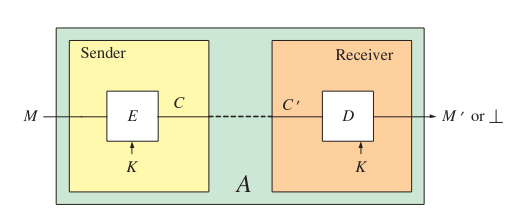
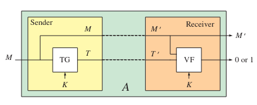
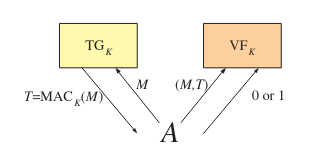
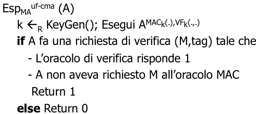
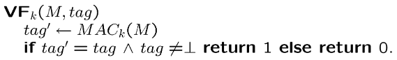
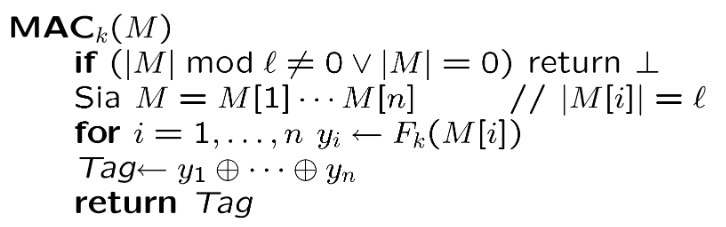
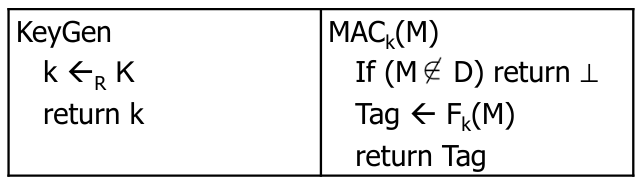
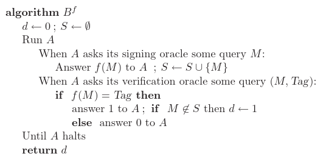
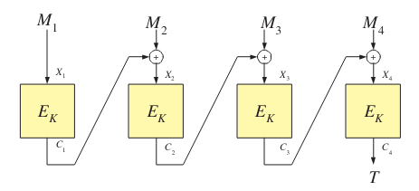
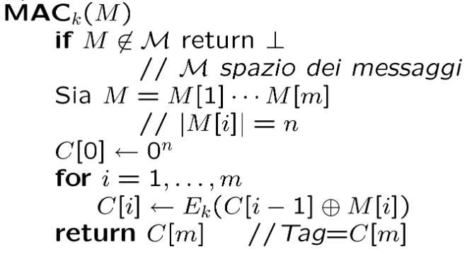

# Message Authentication

[TOC]

## Introduzione

L'autenticità è un obiettivo fondamentale: a differenza della privacy, che non sempre è richiesta, l'autenticità è quasi sempre necessaria, ovvero si vuole sempre essere sicuri che il mittente di un messaggio sia chi noi crediamo di essere. Gli stessi metodi garantiscono l'integrità del messaggio, ovvero che esso non sia stato alterato durante il passaggio nel canale insicuro.

Nella mente della maggior parte delle persone, la privacy è l'obiettivo più fortemente associato alla crittografia. Ma l'autenticazione dei messaggi è probabilmente ancora più importante. In effetti, potrebbe interessarti o meno se un particolare messaggio che invii rimane privato, ma quasi certamente vuoi essere sicuro dell'autore di ogni messaggio su cui agisci. L'autenticazione del messaggio è ciò che ti offre quella garanzia. Esso consente a una parte, il mittente, di inviare un messaggio a un'altra parte, il destinatario, in modo tale che se il messaggio viene modificato lungo il percorso, il destinatario quasi sicuramente lo rileverà. L'autenticazione dei messaggi è anche chiamata autenticazione dell'origine dei dati. Si dice che l'autenticazione del messaggio protegga l'integrità di un messaggio, assicurando che ogni messaggio ricevuto e ritenuto accettabile arrivi nelle stesse condizioni in cui è stato inviato, senza bit inseriti, mancanti o modificati.

Qui esamineremo l'impostazione della chiave condivisa per l'autenticazione dei messaggi (ricorda che l'autenticazione dei messaggi nell'impostazione della chiave pubblica è il problema affrontato dalle firme digitali). In questo caso il mittente e il destinatario condividono una chiave segreta, $K$, che utilizzeranno per autenticare le loro trasmissioni. Definiremo l'obiettivo di autenticazione del messaggio e descriveremo alcuni modi diversi per raggiungerlo. Come al solito, faremo attenzione a individuare il problema che stiamo lavorando per risolvere.


## Contesto

In generale, il mittente $S$ (sender) vuole inviare un messaggio $M$ al destinatario $R$ (receiver), in modo che se $M$ è corrotto, $R$ possa rendersene conto. In questo modo viene protetta l'**integrità** del messaggio. $S$ ed $R$ hanno una chiave segreta in comune $K$ e supponiamo che sia già condivisa tra i due. $S$ produce una autentica $M'$ di un messaggio $M$ e la invia ad $R$. Il destinatario $R$ riceve $M''$ e deve essere in grado di estrapolare il messaggio originale e convalidarlo, verificando se esso sia stato manomesso o meno. 

> **Libro**
>
> L'approccio più generale funziona così. Per autenticare un messaggio M utilizzando la chiave K, il mittente applicherà un algoritmo di cifratura E a K, dando origine a un testo cifrato C. Quando si parla di cifratura M in questo contesto, si usa la parola nel senso più ampio possibile, come qualsiasi tipo di trasformazione con chiave sul messaggio che obbedisce è una definizione precedente per la sintassi di uno schema di crittografia; in particolare, non stiamo suggerendo che C nasconda M. Il mittente S trasmetterà C al destinatario R. Forse il destinatario riceverà C, o forse no. Il problema è che un avversario A può controllare il canale su cui vengono inviati i messaggi. Sia C il messaggio che riceve effettivamente il destinatario. Il ricevitore R, alla ricezione di C , applicherà un algoritmo di decrittazione D a K e C . Vogliamo che questo produca una delle due cose: (1) un messaggio M che è il messaggio originale M; o (2) un'indicazione che C sia considerato non autentico. Vista in questo modo, l'autenticazione dei messaggi viene eseguita da una schema di cifratura. Non siamo più interessati alla privacy dello schema di crittografia ma, funzionalmente, è ancora uno schema di cifratura. A volte utilizziamo il termine crittografia autenticata per indicare che stiamo utilizzando uno schema di crittografia per ottenere l'autenticità.



Poiché il nostro obiettivo di autenticità non riguarda la privacy, molto spesso il testo cifrato $C$ che il mittente trasmette è semplicemente il messaggio originale $M$ insieme a un tag $T$; cioè $C = 〈M, T〉$.
Quando il testo cifrato è di questa forma, chiamiamo il meccanismo **schema di autenticazione del messaggio**.
Uno schema di autenticazione del messaggio sarà specificato da un algoritmo di generazione dei tag $TG$ e da un algoritmo di verifica dei tag $VF$. Il primo può essere probabilistico o stateful; quest'ultimo non è né l'uno né l'altro. L'algoritmo di generazione del tag $TG$ produce un tag $T ← TG_K(M)$ da una chiave $K$ e dal messaggio. L'algoritmo di verifica dei tag $VF ← VF_K(M', T')$ produce un bit da una chiave $K$, un messaggio $M'$ e un tag $T'$. L'intento è che il bit 1 dica al ricevitore di accettare $M'$, mentre il bit 0 dice al ricevitore di rifiutare $M'$.



La possibilità più comune di tutte si verifica quando l'algoritmo di generazione dei tag $TG$ è deterministico e senza stato. In questo caso chiamiamo l'algoritmo di generazione del tag, e lo schema stesso, un codice di autenticazione del messaggio, o $MAC$. Quando l'autenticazione viene eseguita utilizzando un $MAC$, non è necessario specificare un algoritmo di verifica dei tag separato, poiché la verifica dei tag funziona sempre allo stesso modo: il destinatario, dopo aver ricevuto $〈M', T'〉$, calcola $T^* = MAC_K(M')$. Se questo tag calcolato $T$ è identico al tag ricevuto $T$ allora il destinatario considera autentico il messaggio $M$; in caso contrario, il destinatario considera $M$ come non autentico. Scriviamo $T = MAC_K (M)$ per il tag generato dal $MAC$ specificato.

Il destinatario potrebbe voler semplicemente ignorare il messaggio fasullo. Forse era solo rumore sul canale; o forse agire farà più male che bene, aprendo nuove possibilità per attacchi denial-of-service. In alternativa, il destinatario potrebbe voler intraprendere azioni più decisive, come abbattere il canale su cui è stato ricevuto il messaggio e informare qualche essere umano di apparente malizia. La corretta linea di condotta è dettata dalle circostanze e dalla politica di sicurezza del destinatario.


## L'avversario

Durante la comunicazione tra $S$ ed $R$, l'avversario $A$ cercherà di creare un messaggio da inviare ad $R$ lasciandogli credere che il mittente sia proprio $S$. Supporremo che $A$ abbia il controllo del canale di comunicazione. 

Segnaliamo che il successo dell'avversario nel violare l'autenticità richiede un attacco attivo: per avere successo, l'avversario deve fare di più che ascoltare: deve portare un messaggio fasullo al destinatario.
In alcuni scenari di comunicazione può essere difficile per l'avversario far arrivare i suoi messaggi al destinatario. Ad esempio, potrebbe essere difficile per un avversario rilasciare i propri messaggi su un oggetto fisico
linea telefonica protetta o canale in fibra ottica. In altri ambienti può essere banale per l'avversario inserire messaggi sul canale. Poiché non sappiamo quali sono le caratteristiche del canale mittente-ricevente, è meglio presumere il peggio e pensare che l'avversario abbia molto potere su questo canale. In realtà assumeremo anche di più, dando all'avversario il potere di creare messaggi legittimamente autenticati.
Ci teniamo a sottolineare che il problema dell'autenticazione dei messaggi è molto diverso dal problema della privacy. Non ci preoccupa la segretezza del messaggio $M$ ; la nostra preoccupazione è se l'avversario può trarre profitto iniettando nuovi messaggi nel flusso di comunicazioni. Non solo il problema è concettualmente diverso ma, come vedremo ora, la crittografia che garantisce la privacy non fa nulla per garantire l'autenticità del messaggio.


## Autenticità via Privacy

Eseguire la cifratura di un messaggio può garantire la privacy? Supponiamo di inviare $M' = E_k(M)$ ad $R$. Se $R$ decifra ed il risultato **ha senso**, allora esso viene dichiarato autentico. Questo è un ragionamento intuitivo: l'avversario $A$ non conosce $M$ e non è in grado di modificarlo in modo corretto. Eppure potremmo essere in grado di modificare parzialmente il messaggio senza conoscerlo. Tuttavia, che tecniche computazionali utilizziamo per capire se un messaggio ha senso o meno? Se $A$ modificasse un solo bit ed il messaggio continuasse ad avere senso, non dovrebbe essere considerato un falso? In generale dovremmo rigettare il messaggio anche se esso sia modificato di un solo bit, quindi questa metodologia non va bene. In generale, utilizzare per un dato problema dei metodi progettati per risolverne altri è sbagliato: le definizioni sono studiate per obiettivi precisi e specifici. 

Sappiamo come cifrare i dati in modo da garantire la privacy e qualcosa spesso suggerito, e persino fatto, è cifrare come un modo per fornire autenticità. Si fissi uno schema di cifratura simmetrico $SE = (KeyGen, Enc, Dec)$ e si lasci che le parti $S$ e $R$ condividano una chiave $K$ per questo schema. Quando $S$ vuole inviare un messaggio $M$ a $R$, lo cifra, trasferendo un testo cifrato $M' = C$ generato tramite $C ← Enc_K (M)$. Il destinatario lo decifra e, se “ha senso”, considera il messaggio recuperato $M = Dec_K(C)$ come autentico.

Il motivo perché questo funziona è il seguente. Supponiamo, ad esempio, che $S$ trasmetta un messaggio ASCII $M_{100}$ che indica che $R$ deve trasferire 100\$ dal conto corrente di $S$ al conto corrente di un altro soggetto $A$. L'avversario $A$ vuole cambiare l'importo da 100\$ a 900\$. Ora, se $M_{100}$ fosse stato inviato in chiaro, $A$ può facilmente modificarlo. Ma se $M_{100}$ è cifrato in modo che venga inviato il testo cifrato $C_{100}$, come fa $A$ a modificare $C_{100}$ in modo da far recuperare a $S$ il diverso messaggio $M_{900}$? L'avversario $A$ non conosce la chiave $K$, quindi non può cifrare $M_{900}$ da sola. La privacy di $C_{100}$ esclude già che $C_{100}$ possa essere manomesso con profitto.
L'argomento di cui sopra è completamente sbagliato. Per vedere i difetti, diamo prima un'occhiata a un controesempio.
Se cifriamo $M_{100}$ usando un one time pad, allora tutto ciò che l'avversario deve fare è XOR tra il byte del testo cifrato $C_{100}$ che codifica il carattere “1” con lo XOR dei byte per 1 e 9. Cioè, quando one time pad cifra, la riservatezza della trasmissione non rende difficile per l'avversario manomettere il testo cifrato in modo da produrre testi cifrati correlati.

Quello che non dovresti concludere è che one-time pad non è valida. Il nostro obiettivo per one-time pad era quello di fornire privacy, e nulla di ciò che abbiamo detto suggerisce che one-time pad non lo faccia. Incolpare lo schema di cifratura one-time pad per non fornire l'autenticità è come incolpare un'auto per non essere in grado di volare; non c'è motivo di aspettarsi che uno strumento progettato per risolvere un problema sia efficace nel risolverne un altro. Non dovresti concludere che l'esempio è artificioso e che te la caveresti molto meglio con qualche altro metodo di crittografia. La crittografia one-time pad non è affatto inventata.

Quello che dovresti concludere è che la cifratura che garantisce la privacy non è mai stata un approccio appropriato per proteggerne l'autenticità. Il fatto che i dati siano cifrati non deve necessariamente impedire a un avversario di poter far recuperare al destinatario dati diversi da quelli che il mittente aveva inteso. In effetti, con la maggior parte degli schemi di crittografia, qualsiasi testo cifrato verrà decrittografato in qualcosa, quindi anche una trasmissione casuale farà sì che il destinatario riceva qualcosa di diverso da ciò che il mittente intendeva, che non era quello di inviare alcun messaggio. Ora forse il testo cifrato casuale sembrerà spazzatura al ricevitore, o forse no. Dal momento che non sappiamo cosa intenda fare il destinatario con i suoi dati è impossibile dirlo.


## Sintassi per l'autenticazione dei messaggi

Abbiamo delineato tre approcci, ciascuno più ristretto del successivo, per fornire autenticità. La prima, che abbiamo chiamato **cifratura autenticata**, fornisce autenticità utilizzando quello che è uno schema di cifratura simmetrica $Π = (KeyGen, Enc, Dec)$. Lo scopo immaginato si sposta dal fornire privacy al fornire autenticità, ma la sintassi non cambia. Ricordiamo che abbiamo già integrato nella nostra definizione di uno schema di cifratura simmetrica la possibilità che la decrittazione restituisca un valore distinto. Non abbiamo utilizzato questa capacità per definire la privacy, ma ne avremo bisogno per l'autenticità. Intuitivamente, il meccanismo di decrittazione che emette ⊥ viene interpretato nel senso che il testo cifrato ricevuto (cioè il messaggio autenticato) deve essere considerato non valido.
Abbiamo anche individuato due modi più specifici per fornire autenticità. Casi speciali degli schemi di crittografia di cui sopra progettati. Il primo era uno schema di autenticazione dei messaggi. Formalmente, questa è una coppia di algoritmi $(TG, VF)$. Il primo di questi può essere probabilistico o stateful, mentre il secondo è deterministico. L'algoritmo $TG$ (per “generazione di tag”) prende come input una stringa $k ∈ K$ , per qualche insieme associato $K$, e una stringa $M ∈ \{0, 1\}^*$. L'insieme $K$ è finito o ha una distribuzione di probabilità associata (dobbiamo essere in grado di scegliere un punto $k$ casuale da $K$). L'algoritmo di generazione dei tag $TG$ produce un tag $T ← TG_k(M) ∈ \{0, 1\}^* ∪ \{⊥\}$ . L'algoritmo $VF$ (per “verifica”) prende come input le stringhe $k ∈, M ∈ \{0, 1\}^∗$, e $T ∈ \{0, 1\}^∗$. Emette un bit $VF_k(M, T) ∈ \{0, 1\}$. La semantica prevista è 1 per accettare e 0 per rifiutare. Insistiamo sul fatto che se $T ← TG_k(M)$ e T = ⊥ allora $VF_k (M, T) = 1$. Ogni schema di autenticazione dei messaggi dà origine a uno schema di cifratura in cui $Enc_k(M)$ calcola $T \leftarrow TG_k(M)$ e restituisce $〈M, T〉$ e $Dec_k(〈M, T〉) = M$ se $VF_k(M, T) = 1$ altrimenti $\bot$. 

Un codice di autenticazione del messaggio (MAC) corrisponde al caso speciale di uno schema di autenticazione del messaggio in cui la generazione dei tag è deterministica e stateful. Formalmente, un codice di autenticazione del messaggio è un algoritmo deterministico $MAC: K × \{0, 1\}^*→ \{0, 1\}^*∪ \{⊥\}$ dove $K$ è un insieme finito, o è comunque dotato di una distribuzione di probabilità. Il tag per un messaggio $M$ è $T = MAC_k(M)$.
Per verificare $〈M, T〉$ il ricevitore verifica se $T = MAC_k(M)$. In caso affermativo, il messaggio M è considerato autentico; in caso contrario, il messaggio viene considerato un falso. Tieni presente che le nostre definizioni non consentono il ripristino/verifica di messaggi con stato. Le funzioni stateful per il destinatario possono essere problematiche a causa della possibilità che i messaggi non raggiungano la loro destinazione: è troppo facile per il destinatario trovarsi in uno stato diverso da quello che vorremmo. Tuttavia, le stesse funzioni di verifica MAC stateful sono essenziali per rilevare "attacchi di replay". Ricordiamo che era essenziale per la sicurezza IND-CPA di uno schema di cifratura che l'algoritmo di cifratura fosse probabilistico o stateful: non era possibile ottenere la sicurezza IND-CPA con un algoritmo di cifratura deterministico. Ma vedremo che il probabilismo e lo stato non sono necessari per ottenere l'autenticazione sicura dei messaggi. Questa consapevolezza è insita nel fatto che ci occupiamo di MAC.


## Definizione MAC

Definiamo la tripla di algoritmi (KeyGen, MAC, VF) dove:

* KeyGen restituisce una stringa casuale (chiave) da un insieme
* MAC prende in input una chiave ed un messaggio e restituisce un tag (o errore)
* VF è deterministico e prende in input una chiave $k$, un messaggio $M$ ed un tag e restituisce un bit $d$

Se $d=1$ allora il messaggio è l'originale, altrimenti è stato manomesso nel canale.

L'algoritmo MAC può essere deterministico, randomizzato o a stati. Difficilmente si vedranno MAC a stati poiché assai problematici (ma necessari per risolvere alcuni attacchi come il replay attack). Vedremo in seguito che gli algoritmi MAC utilizzati nella pratica sono tutti deterministici, a differenza del caso della cifratura per garantire privacy che necessitava di cifrari non deterministici (la stessa restrizione non vale per l'autenticità). 

Concentriamoci prima sui codici di autenticazione dei messaggi. Iniziamo con una discussione dei problemi e poi enunciamo una definizione formale.
L'obiettivo che cerchiamo di raggiungere con un MAC è essere in grado di rilevare qualsiasi tentativo dell'avversario di modificare i dati trasmessi. Non vogliamo che l'avversario sia in grado di produrre messaggi che il destinatario riterrà autentici: solo il mittente dovrebbe essere in grado di farlo. Cioè, non vogliamo che l'avversario $A$ sia in grado di generare $(M, Tag)$ tale che $VF_k (M, Tag) = 1$, ma $M$ non abbia avuto origine dal mittente $S$. Tale coppia $(M , Tag)$ è chiamato un **falso**. In alcune discussioni sulla sicurezza si presume che l'obiettivo dell'avversario sia quello di recuperare la chiave segreta $k$. Certamente se potesse farlo, sarebbe un disastro, poiché potrebbe quindi falsificare qualsiasi cosa. È importante capire, tuttavia, che un avversario potrebbe essere in grado di falsificare senza poter recuperare la chiave, e se tutto ciò che chiedessimo fosse che l'avversario non fosse in grado di recuperare la chiave, chiederemmo troppo poco. Ciò che conta è la contraffazione, non il recupero delle chiavi.
Ora bisogna ammettere subito che alcune falsificazioni potrebbero essere inutili per l'avversario.
Ad esempio, forse l'avversario può falsificare, ma può solo falsificare stringhe che sembrano casuali; nel frattempo, supponiamo che tutti i messaggi "buoni" debbano avere un certo formato. Questo dovrebbe davvero essere visto come un falso? La risposta è si. Se il controllo che il messaggio fosse di un certo formato fosse davvero una parte della convalida del messaggio, allora questo sarebbe stato considerato come parte del codice di autenticazione del messaggio. In assenza di ciò, non sta a noi fare supposizioni su come i messaggi sono formattati o interpretati; non ne abbiamo davvero idea. Una buona progettazione del protocollo significa che la sicurezza è garantita indipendentemente dall'applicazione.
Nel tentativo del nostro avversario di falsificare un messaggio potremmo considerare vari attacchi. L'impostazione più semplice è che l'avversario vuole falsificare un messaggio anche se non ha mai visto alcuna trasmissione inviata dal mittente. In questo caso l'avversario deve inventare una coppia $(M, Tag)$ che sia valida, anche se non ha ottenuto alcuna informazione utile. Questo è chiamato **attacco senza messaggi**. Spesso non si riesce a catturare le capacità di avversari realistici, poiché un avversario che può iniettare messaggi fasulli sui mezzi di comunicazione può probabilmente vedere anche messaggi validi. Dovremmo lasciare che l'avversario usi queste informazioni.
Supponiamo che il mittente invii la trasmissione $(M, Tag)$ costituita da un messaggio $M$ e dal suo tag legittimo $Tag$ . Il ricevitore accetterà sicuramente questo, che è integrato nella nostra definizione. Ora viene subito in mente un semplice attacco: l'avversario può semplicemente ripetere questa trasmissione, $(M, Tag)$, e far sì che il destinatario la accetti ancora una volta. Questo attacco è inevitabile, perché il nostro MAC è una funzione deterministica che il ricevitore ricalcola. Se il destinatario ha accettato $(M, Tag)$ una volta, è obbligato a farlo ancora.
Quello che abbiamo appena descritto si chiama **attacco replay**. L'avversario vede una coppia valida $(M, Tag)$ dal mittente, e in un momento successivo lo ritrasmette. Dal momento che il ricevitore l'ha accettato la prima volta, lo farà di nuovo. Un attacco replay dovrebbe essere considerato un falso valido? Nella vita reale di solito dovrebbe. Supponiamo che il primo messaggio sia stato "Trasferisci \$1000 dal mio account all'account della parte A". Quindi la parte A potrebbe avere un modo semplice per arricchirsi: continua a riprodurre lo stesso messaggio autenticato, guardando felicemente il suo conto in banca crescere.
È importante proteggersi dagli attacchi di replay. Ma per il momento non proveremo a farlo. Diremo che un replay non è un falso valido; per essere valido un falso deve essere di un messaggio $M$ che non sia stato già prodotto dal mittente. Vedremo in seguito che possiamo sempre ottenere sicurezza contro gli attacchi di replay con mezzi semplici; cioè, possiamo prendere qualsiasi meccanismo di autenticazione del messaggio che non è sicuro contro gli attacchi di replay e modificarlo, dopo aver reso il destinatario stateful, in modo che sia sicuro contro gli attacchi di replay. A questo punto, non preoccuparsi degli attacchi di replay si traduce in una definizione del problema più chiara e ci porta ad un approccio di progettazione del protocollo più modulare, ovvero suddividiamo il problema in parti sensibili ("sicurezza di base" e quindi "sicurezza di riproduzione") risolvendole una per una.
Ovviamente non c'è motivo di pensare che l'avversario si limiterà a vedere un solo messaggio esemplificativo. Gli avversari realistici possono vedere milioni di messaggi autenticati, e tuttavia dovrebbe essere difficile per loro falsificarli.
Per alcuni schemi di autenticazione dei messaggi, la capacità dell'avversario di falsificare aumenterà con il numero $q_s$ di coppie di tag messaggio legittime che vede. Allo stesso modo, in alcuni sistemi di sicurezza il numero di coppie valide $(M, Tag)$ che l'avversario può ottenere può essere limitato dall'architettura. (Ad esempio, un firmatario stateful potrebbe non essere disposto a utilizzare MAC per più di un certo numero di messaggi.) Quindi, quando diamo il nostro trattamento quantitativo della sicurezza, tratteremo $q_s$ come un'importante risorsa contraddittoria.
Come nascono esattamente tutti questi messaggi con tag? Potremmo pensare che ci sia una distribuzione sui messaggi che il mittente autenticherà, ma in alcune impostazioni è persino possibile per l'avversario influenzare quali messaggi sono taggati. Nel peggiore dei casi, immagina che sia l'avversario stesso a scegliere quali messaggi vengono autenticati. Cioè, l'avversario sceglie un messaggio, ottiene il suo tag, sceglie un altro messaggio, ottiene il suo tag e così via. Poi prova a falsificare. Questo è chiamato **attacco adattivo del messaggio scelto**. Vince se riesce a falsificare il MAC di un messaggio che non ha interrogato al mittente.
A prima vista può sembrare che un attacco adattivo al messaggio scelto sia irrealisticamente generoso nei confronti del nostro avversario; dopotutto, se un avversario potesse davvero ottenere un tag valido per qualsiasi messaggio che desidera, ciò non renderebbe discutibile l'intero punto dell'autenticazione dei messaggi? In effetti, ci sono diversi buoni argomenti per consentire all'avversario una capacità così forte. In primo luogo, vedremo esempi, protocolli di livello superiore che utilizzano i MAC, in cui gli attacchi adattivi del messaggio scelto sono abbastanza realistici.
In secondo luogo, ricorda i nostri principi generali. Vogliamo progettare schemi che siano sicuri in qualsiasi utilizzo. Ciò richiede che facciamo nozioni di sicurezza nel caso peggiore, in modo che quando erriamo nel modellare realisticamente le capacità dell'avversario, commettiamo un errore dalla parte della cautela, consentendo all'avversario più potere di quanto potrebbe realmente avere. Poiché alla fine progetteremo schemi che soddisfano le nostre rigorose nozioni di sicurezza, guadagniamo solo quando assumiamo che il nostro avversario sia forte.
Come esempio di un semplice scenario in cui un attacco adattivo del messaggio scelto è realistico, immagina che il mittente $S$ stia inoltrando messaggi a un destinatario $R$. Il mittente riceve messaggi da un numero qualsiasi di terze parti, $A_1, . . . , A_n$. Il mittente riceve un dato $M$ dalla parte $A_i$ lungo un canale sicuro, quindi trasmette al destinatario $〈i〉 ‖ M ‖ M AC_k (〈i〉 ‖ M )$. Questo è il modo in cui il mittente attesta di aver ricevuto il messaggio $M$ dalla parte $A_i$. Ora, se una di queste terze parti, diciamo $A_1$, vuole svolgere un ruolo contraddittorio, chiederà al mittente di inoltrare i suoi messaggi scelti in modo adattativo $M_1, M_2, . . .$ al ricevitore. Se, in base a ciò che vede, può imparare la chiave $k$, o anche se può imparare a falsificare un messaggio della forma 〈$2〉 ‖ M$ , in modo da produrre un messaggio valido $〈2〉 ‖ M ‖ M AC_k (〈 2〉 ‖ M )$, allora l'intento del protocollo sarà stato sconfitto. Finora abbiamo detto che vogliamo dare al nostro avversario la possibilità di ottenere MAC per messaggi di sua scelta, e poi vogliamo vedere se può o meno falsificare: produrre una coppia valida $(M, Tag)$ che non ha mai chiesto al mittente. Ma dovremmo riconoscere che un avversario realistico potrebbe essere in grado di produrre un sacco di falsi candidati, e potrebbe essere contento se qualcuno di questi possa essere valido. Possiamo modellare questa possibilità dando all'avversario la capacità di dire se una potenziale coppia $(M, Tag)$ è valida, e dicendo che l'avversario falsifichi se trova una coppia $(M, Tag)$ tale che $M$ non sia mai stato maccato dal mittente. Se un vero avversario può o meno provare molti possibili falsi dipende dal contesto.
Supponiamo che il destinatario interrompa una connessione nel momento in cui rileva un tag non valido. Quindi non è realistico provare a utilizzare questo ricevitore per aiutarti a determinare se una coppia candidata $(M, Tag)$ è valida: un errore e il gioco è fatto. In questo caso, pensare che ci sia un solo tentativo di falsificare un messaggio è abbastanza adeguato.
D'altra parte, supponiamo che un destinatario ignori semplicemente qualsiasi messaggio etichettato in modo improprio, mentre risponde in un modo notevolmente diverso se riceve un messaggio correttamente autenticato. In questo caso una strategia contraddittoria abbastanza ragionevole può essere quella di chiedere al verificatore la validità di un gran numero di coppie candidate $(M, Tag)$. L'avversario spera di trovarne almeno una valido. Quando l'avversario trova una tale coppia $(M, Tag)$, diremo che ha vinto.
Riassumiamo. Per essere del tutto generali, daremo al nostro avversario due diverse capacità:

- La prima capacità contraddittoria consiste nell'ottenere un MAC di $M$ per qualsiasi messaggio che sceglie. Chiameremo questa **query di firma**. L'avversario ne farà un certo numero, $q_s$. 
- La seconda capacità contraddittoria è scoprire se una particolare coppia $(M, Tag)$ è valida. La chiameremo una **query di verifica**. L'avversario ne farà un certo numero, $q_v$. Si dice che il nostro avversario riesca, a falsificare, se fa mai una query di verifica $(M, Tag)$ e ottiene un valore di ritorno di 1 (accetta) anche se il messaggio $M$ non è un messaggio di cui l'avversario conosceva già un tag. 

Procediamo ora in modo più formale. Sia $MAC: K×\{0, 1\}^*→ \{0, 1\}^*$ un codice di autenticazione del messaggio arbitrario. Formalizzeremo una nozione quantitativa di sicurezza contro l'attacco adattivo del messaggio scelto. Iniziamo descrivendo il modello. Non è necessario, nel modello, pensare al mittente e al verificatore come entità animate. Lo scopo del mittente, dal punto di vista dell'avversario, è autenticare i messaggi. Quindi incorporeremo il mittente come un oracolo che l'avversario può utilizzare per autenticare qualsiasi messaggio $M$. Questo oracolo di generazione di tag, come lo chiameremo, è il nostro modo per fornire all'avversario l'accesso black-box alla funzione $MAC_k (·)$.

Lo scopo del verificatore, dal punto di vista dell'avversario, è quello di far verificare i tentativi di falsificazione. Quindi incorporeremo il verificatore come un oracolo che l'avversario può usare per vedere se una coppia candidata $(M, Tag)$ è valida. Questo oracolo di verifica, come lo chiameremo, è il nostro modo per fornire all'avversario l'accesso black-box alla funzione $VF_k (·)$ che è 1 se $Tag = MAC_k (M)$ e 0 altrimenti. Così, quando diventiamo formali, il cast dei personaggi - il mittente, il destinatario e l'avversario - si riduce al solo avversario, che esegue i suoi oracoli.



L'avversario $A$ ha accesso a un oracolo per la generazione di tag e a un oracolo per la verifica dei tag. L'avversario vuole che l'oracolo di verifica risponda 1 ad alcune coppie $(M, Tag)$ per le quali non ha chiesto in precedenza all'oracolo di firma $M$. L'oracolo di verifica restituisce 1 se $Tag = MAC_k (M)$ e 0 se $Tag \neq MAC_k (M)$.


### Definizione formale

Sia $MAC: K \times \{0,1\}^* \rightarrow \{0,1\}^*$ un codice di autenticazione del messaggio e sia $A$ un avversario. Consideriamo il seguente esperimento:



Il vantaggio $uf-cma$ di $A$ è definito come segue:
$$
Adv_{MAC}^{uf-cma}(A) = Pr[Exp_{MAC}^{uf-cma}(A) = 1]
$$
Diremo che viene garantita la non falsificabilità con messaggio in chiaro se per ogni avversario $A$ polinomialmente limitato $Adv_{MAC}^{uf-cma}(A) \simeq 0$.

Discutiamo la definizione di cui sopra. Crea un codice di autenticazione del messaggio, MAC. Quindi associamo a qualsiasi avversario $A$ il suo "vantaggio" o "probabilità di successo". Indichiamo questo valore come $Adv^{uf-cma}_{MAC} (A)$. È solo la possibilità che $A$ riesca a falsificare. La probabilità è sulla scelta della chiave $k$ e sulle scelte probabilistiche, se presenti, che l'avversario $A$ fa. Come al solito, il vantaggio che si può ottenere dipende sia dalla strategia dell'avversario che dalle risorse che utilizza. Informalmente, è sicuro se il vantaggio di un avversario pratico è basso. Come al solito, c'è una certa arbitrarietà su quali risorse misuriamo. Certamente è importante separare le query degli oracoli ($q_s$ e $q_v$) dal tempo. In pratica, le query di firma corrispondono ai messaggi inviati dal mittente legittimo e ottenerli è probabilmente più difficile che limitarsi a calcolarli da soli. Le query di verifica corrispondono ai messaggi che l'avversario spera che il verificatore accetti, quindi scoprire se accetta nuovamente queste query richiede l'interazione. Alcune architetture di sistema possono effettivamente limitare $q_s$ e $q_v$. Nessuna architettura di sistema può limitare $t$; che è limitato principalmente dal budget dell'avversario. Sottolineiamo che ci sono contesti in cui sei soddisfatto di un MAC che rende impraticabile la contraffazione quando $q_v = 1$ e $q_s = 0$ (un "attacco di rappresentazione") e ci sono contesti in cui sei felice quando la contraffazione è impraticabile quando $q_v = 1$ e $q_s = 1$ (un "attacco di sostituzione"). Ma forse è più comune che tu voglia che la contraffazione non sia pratica anche quando $q_s$ è grande, come $2^{50}$, e anche quando $q_v$ è grande.

Naturalmente la chiave $k$ non viene data direttamente all'avversario, né vengono utilizzate scelte casuali o contatore dall'algoritmo di generazione MAC. L'avversario vede queste cose solo nella misura in cui si riflettono nelle risposte alle sue domande oracolari.

### Verifica

Se MAC è deterministico, come nel nostro caso, l'algoritmo di verifica è sempre lo stesso:



Dunque per tali MAC non abbiamo bisogno di specificare un algoritmo di verifica.


### Esempio

Con una definizione per la sicurezza MAC in mano, non è difficile per noi definire in modo simile l'autenticità per gli schemi di crittografia e gli schemi di autenticazione dei messaggi.

Esaminiamo alcuni codici di autenticazione dei messaggi di esempio e utilizziamo la definizione per valutarne i punti di forza e di debolezza. Fissiamo una **PRF** $F: K \times \{0,1\}^n \rightarrow \{0,1\}^n$. Lo schema $MAC_1: K \times \{0,1\}^* \rightarrow \{0,1\}^*$ funziona come segue:



Ora proviamo a valutare la sicurezza di questo codice di autenticazione del messaggio. Supponiamo che l'avversario voglia falsificare il tag di un determinato messaggio $M$ . A priori non è chiaro che si possa fare. L'avversario non è in possesso della chiave segreta $k$, quindi non può calcolare $F_k$ e usarla per calcolare $Tag$ . Ma ricorda che la nozione di sicurezza che abbiamo definito dice che l'avversario ha successo fintanto che può produrre un tag corretto per qualche messaggio, non necessariamente uno dato. Notiamo ora che anche senza un attacco con il messaggio scelto (in realtà senza vedere alcun esempio di dati correttamente taggati) l'avversario può farlo. Può scegliere un messaggio $M$ composto da due blocchi uguali, diciamo $M = X||X$ dove $X$ è una stringa di *n* bit, impostare $T ← 0^n$ ed eseguire una query di verifica $(M, Tag)$. Si noti che $VF_k(M, Tag ) = 1$ perché $FK (x) ⊕ FK (x) = 0^n = T$. Più in dettaglio, l'avversario è il seguente:

```pseudocode
A(MA):
	x <-R {0, 1}^l
	M <- x||x
	Tag <- 0^n
	d <- VF_k(M, Tag)
```

In questo caso si ha che:
$$
Pr[Esp^{uf-cma}(A) = 1] = 1
$$
per tale motivo il vantaggio dell'avversario è:
$$
Adv^{uf-cma}_{MAC}(A) = 1
$$
Inoltre, l'avversario $A$ non effettua nessuna chiamata all'oracolo di firma, usando un tempo lineare.

Ci sono molti altri tipi di attacchi. Per esempio è possibile notare che:
$$
T = F_k(M_1) \oplus F_k(M_2)
$$
esso non è solo il tag di $M_1M_2$, ma è anche il tag di $M_2M_1$. Quindi è possibile, dato il tag di un messaggio, per falsificare il tag di un nuovo messaggio permutando i blocchi del vecchio messaggio. L'avversario in questo caso è il seguente:

```pseudocode
A(MA):
	X, Y <-R {0,1}^n
	M1 = X||Y
	M2 = Y||X
	T1 = O_mac(M1)
	T2 = T1[2] || T1[1]
	d <- VF_k(M2, T2)
```

Altri esempi sono riportati nel libro a pagina 165.


### Il paradigma PRF come MAC

Le funzioni pseudocasuali creano buoni MAC e costruire un MAC in questo modo è un approccio eccellente. La sicurezza del MAC costruito nel modo che vedremo è praticamente la stessa della PRF utilizzata (la dimostrazione non degrada di molto la sicurezza).  

Sia $F: K \times D \rightarrow \{0,1\}^{\tau}$ una famiglia di funzioni. Associamo a $F$ un codice di autenticazione del messaggio $MAC: K \times D \rightarrow \{0,1\}^{\tau}$ come segue:



Si noti che quando pensiamo a una PRF come a un MAC è importante che il dominio della PRF sia quello che si vuole come dominio del MAC. Quindi una tale PRF probabilmente non sarà realizzata come un cifrario a blocchi. Potrebbe essere necessario realizzare una PRF che consenta input di molte lunghezze diverse, poiché potresti voler inviare messaggi MAC di molte lunghezze diverse. Finora non abbiamo dimostrato di poter realizzare tali PRF. Ma lo faremo. Mettiamo prima in relazione la sicurezza del MAC di cui sopra con quella della PRF.

**Preposizione**

Sia $F : K × D → \{0, 1\}^τ$ una famiglia di funzioni e sia MAC il codice di autenticazione del messaggio associato come definito sopra. Sia $A$ un qualsiasi avversario che attacca $MA = (KeyGen, MAC)$, effettuando $q_s$ query di generazione MAC della lunghezza totale $μ_s$, $q_v$ query di verifica MAC della lunghezza totale $μ_v$ e con tempo di esecuzione $t$. Allora esiste un avversario $B$ che attacca $F$ tale che:
$$
Adv^{uf-cma}_{MA} \le Adv^{prf}_{F}(B) + \frac{q_v}{2^\tau}
$$
**Dimostrazione**

Si ricorda che a $B$ viene assegnato un oracolo per una funzione $f : D → \{0, 1\}^τ$ . Verrà eseguito $A$, fornendogli un ambiente in cui le domande all'oracolo di $A$ ricevono risposta da $B$.



$B$ ha un avversario bravo a rompere il $MAC$ allora posso usarlo per rompere la $PRF$.
$$
Pr[Esp^{prf-1}(B) = 1] = Adv^{uf-cma}_{MA}(A) \\
Pr[Esp^{prf-0}(B) = 1] = \frac{q_v}{2^\tau}
$$
Nel primo caso $f$ è un'istanza di $F$ , quindi l'ambiente simulato che $B$ sta fornendo per $A$ è esattamente quello dell'esperimento $Esp^{uf-cma}_{MA}(A)$. Poiché $B$ restituisce 1 esattamente quando $A$ esegue una query di verifica con successo, si ha la prima equazione.

Nel secondo caso, $A$ è in esecuzione in un ambiente ad esso estraneo, ovvero uno in cui viene utilizzata una funzione casuale per calcolare i MAC. Non abbiamo idea di cosa farà $A$ in questo ambiente, ma non importa cosa, sappiamo che la probabilità che una particolare query di verifica $(M, Tag )$ con $M \notin S$ riceva 1 risposta è al più $2^{−τ}$ , perché questa è la probabilità che $Tag = f(M)$. Poiché ci sono al massimo $q_v$ query di verifica, segue la seconda equazione.

È stato detto che l'avversario fa fino a $q_v$ domande di verifica.
$$
Pr[Succ] = Pr[T_1 \cup T_2 \cup ... \cup T_{q_v}]\\
Pr[A \cup B] = Pr[A] + Pr[B] - Pr[A \cap B] \le \\ 
\le Pr[A] + Pr[B] \le \\
\le Pr[T_1] + ... + Pr[T_n] = \frac{q_v}{2^\tau}
$$

### CBC-MAC

Una classe molto popolare di MAC si ottiene tramite il concatenamento a blocchi di cifratura di un dato cifrario a blocchi. Come mostrato nella seguente immagine.



Sia $E: K \times \{0,1\}^n \rightarrow \{0,1\}^n$ un cifrario a blocchi. Il $CBC-MAC$ sul cifrario a blocchi $E$ ha uno spazio delle chiavi $K$ ed è dato dal seguente algoritmo:



Come vedremo in seguito, il CBC-MAC è sicuro solo se si limita l'attenzione a stringhe di una particolare lunghezza: il dominio è limitato a $\{0, 1\}^{mn}$ per qualche costante $m$. Se applichiamo CBC-MAC a messaggi di lunghezza variabile, sarà facile distinguere questo oggetto da una funzione casuale

Pag. 169 e slide 31
