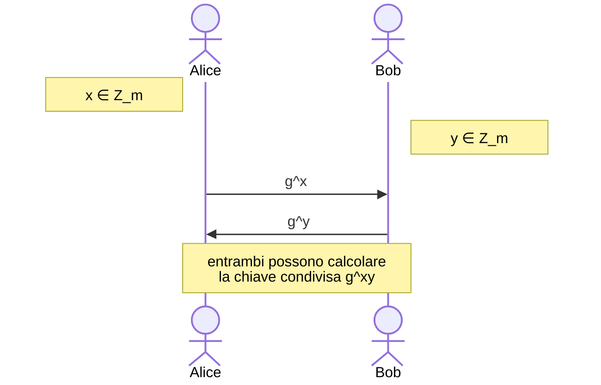

<h1 style="text-align: center">Primitive asimmetriche</h1>

[TOC]

Con il termine "**Primitive asimmetriche**" ci si riferisce a tutta una serie di problemi computazionali che rappresentano la base necessaria per costruire sistemi di cifratura asimmetriche affidabili.

## Tabella riassuntiva dei problemi


| Problema | Input | Output da trovare |
| - | - | - |
| `Logaritmo discreto` (**dl**) | $g^x$ | $x$ |
| `Il problema computazionale Diffie-Hellman ` (**cdh**) | $g^x, g^y$ | $g^{xy}$ |
| `Il problema decisionale Diffie-Hellman ` (**ddh**) | $g^x, g^y, g^z$ | $\text{Is } z \equiv xy \mod{|G|}$ |

## Logaritmo discreto (su gruppi finiti)

Sia $G$ un gruppo ciclico e $g$ un generatore di $G$. Questo vuol dire che $G = \{g^0, g, g^2, g^3, ..., g^{m-1}\}$, dove $m = |G|$, ordine di $G$.
La funzione `Logaritmo discreto` $DLog_{G,g}: G \rightarrow Z_m$ prende in input un elemento $a \in G$, e restituisce un $i \in Z_m$ tale che $a = g^i$.

### Definizione formale  (dl)

Per descrivere formalmente la difficoltà  che si ha nel calcolo della funzione `Logaritmo discreto`, si può utilizzare il seguente esperimento.

Sia $G$ un gruppo ciclico di ordine $m = |G|$ e $g$ un generatore di $G$. Si consideri quindi l'elemento $x \xleftarrow{$} G$.

Un avversario A riceve come input un valore $X = g^x$, e il suo obiettivo è quello di determinare il valore di $x$.

```pseudocode
ESP_{G,g}^{dl}(A):
	x <-R- Z_m
	X <- g**x
	x` <- A(X)
	if g**x` == X:
		return 1
	return 0
```

Il vantaggio di A in senso **df** è così definito:
$$
Adv_{G,g}^{df}(A) = Pr[Esp_{G,g}^{df}(A)=1]
$$
Il problema del `Logaritmo discreto` è intrattabile in $G$  se il vantaggio così definito è prossimo a 0 per ogni avversario A computazionalmente limitato.
Al momento possiamo basarci sula congettura che, per determinati gruppi, il problema del `Logaritmo discreto` sia (asintoticamente) intrattabile, in particolare per $Z_p^*$ e gruppi di punti di curve ellittiche su campi finiti, fintanto che la dimensione del problema è sufficientemente grande.

## Il problema computazionale Diffie-Hellman

Sia $G$ un gruppo con $m = |G|$ ordine del gruppo, nel quale il `Logaritmo discreto` è _(stando alla congettura)_ difficile. Sotto queste ipotesi, si immagini il seguente scambio di messaggi attraverso un canale insicuro.
Alice sceglie un $x \xleftarrow{$} Z_m$ e Bob fa lo stesso scegliendo $y \xleftarrow{$} Z_m$. Dopo essersi scambiati rispettivamente $g^x$ e $g^y$, dove $g$ è un generatore di $Z_m$, entrambi possono facilmente calcolare $g^{xy}$, poiché che già  conoscono $x$ o $y$.



Per poter recuperare la chiave condivisa $g^{xy}$, un avversario che non ha accesso a $x$ e $y$ può solo provare ad ottenere $g^{xy}$ conoscendo solo $X = g^x$ e $Y = g^y$. Questo è proprio il `problema computazionale Diffie-Hellman`.

### Definizione formale (cdh)

Per descrivere formalmente la difficoltà  che si ha nella risoluzione del `problema computazionale Diffie-Hellman` si può utilizzare il seguente esperimento.

Sia $G$ un gruppo ciclico di ordine $m = |G|$ e $g$ un generatore di $G$. Si considerino quindi due elementi $x \xleftarrow{$} G$ e $y \xleftarrow{$} G$.

Un avversario A riceve come input i valori $X = g^x$ ed $Y = g^y$, e il suo obiettivo è quello di determinare il valore di $g^{xy}$.

```pseudocode
ESP_{G,g}^{cdh}(A):
	x <-R- Z_m
	y <-R- Z_m
	X <- g**x
	Y <- g**y
	Z <- A(X, Y)
	if Z == g**(x*y):
		return 1
	return 0
```

l vantaggio di A in senso **cdh** è così definito:
$$
Adv_{G,g}^{cdh}(A) = Pr[Esp_{G,g}^{cdh}(A)=1]
$$
Il `problema computazionale Diffie-Hellman` è intrattabile in $G$ se il vantaggio così definito è prossimo a 0 per ogni avversario computazionalmente limitato.

Si noti inoltre che il `problema computazionale Diffie-Hellman` non può essere più difficile del problema del `Logaritmo discreto`. Persiste infatti la relazione
$$
Adv_{G,g}^{dl}(A) \le Adv_{G,g}^{cdh}(A)
$$
Ciò indica che se il problema del `Logaritmo discreto` è trattabile, lo è sicuramente anche quello `computazionale Diffie-Hellman`,  in quanto un avversario con un vantaggio sufficientemente grande per il primo ne avrebbe uno almeno altrettanto grande per il secondo. Non è vero il contrario.
Attualmente l'unico modo conosciuto per risolvere il `problema computazionale Diffie-Hellmane` è risolvere il `Logaritmo discreto`.

## Il problema decisionale Diffie-Hellman

Dopo aver ottenuto una chiave condivisa $g^{xy}$, ci si pone il quesito se questo valore appare random agli occhi di un qualunque avversario computazionalmente limitato. Riuscire a distinguere $g^{xy}$ da un numero casuale nella forma $g^h$ con $h \xleftarrow{$} Z_m$ è proprio il  `problema decisionale Diffie-Hellman`.

### Definizione formale (ddh)

Per descrivere formalmente la difficoltà  che si ha nella risoluzione del `problema decisionale Diffie-Hellman` si può utilizzare la seguente coppia di esperimenti.

Sia $G$ un gruppo ciclico di ordine $m = |G|$ e $g$ un generatore di $G$. Si considerino quindi due elementi $x \xleftarrow{$} G$ e $y \xleftarrow{$} G$, ed un terzo elemento $z$ che cambia a seconda dell'esperimento:
$$
z = \begin{cases} 
x \cdot y \mod{m} & \text{se siamo nel mondo } 1 \\  
\xleftarrow{$} Z_m & \text{se siamo nel mondo } 0
\end{cases}
$$
Un avversario A riceve come input i valori $X = g^x$,$Y = g^y$ e $Z = g^z$, e il suo obiettivo è quello di determinare in quale dei due esperimenti si trovi attraverso un bit di output.

```pseudocode
ESP_{G,g}^{ddh-1}(A):
	x <-R- Z_m
	y <-R- Z_m
	z <- (x*y) % m
	X <- g**x
	Y <- g**y
	Z <- g**z
	d <- A(X, Y, Z)
	return d

ESP_{G,g}^{ddh-0}(A):
	x <-R- Z_m
	y <-R- Z_m
	z <-R- Z_m
	X <- g**x
	Y <- g**y
	Z <- g**z
	d <- A(X, Y, Z)
	return d
```

l vantaggio di A in senso **ddh** è così definito:
$$
Adv_{G,g}^{ddh}(A) = |Pr[Esp_{G,g}^{ddh-1}(A)=1] - Pr[Esp_{G,g}^{ddh-0}(A)=1]|
$$
Il `problema decisionale Diffie-Hellman` è intrattabile in $G$ se il vantaggio così definito è prossimo a 0 per ogni avversario computazionalmente limitato.

Si noti inoltre che il `problema decisionale Diffie-Hellman` non può essere più difficile del `problema computazionale Diffie-Hellman`. Persiste infatti la relazione
$$
Adv_{G,g}^{cdh}(A) \le Adv_{G,g}^{ddh}(A) + \frac{1}{|G|}
$$
Ciò indica che se il problema del `problema computazionale Diffie-Hellman` è trattabile, lo è sicuramente anche quello `decisionale Diffie-Hellman`,  in quanto un avversario con un vantaggio sufficientemente grande per il primo ne avrebbe uno almeno altrettanto grande per il secondo. Non è vero il contrario.
Sebbene esistano alcuni gruppi in cui il `problema decisionale Diffie-Hellman` è facile mentre il `problema computazionale Diffie-Hellman` non lo è, se $G$ è scelto adeguatamente l'unico modo conosciuto per risolvere il `problema computazionale Diffie-Hellmane` è risolvere il `problema computazionale Diffie-Hellman`.

## Calcolare logaritmi discreti

Si possono individuare due famiglie principali fra gli algoritmi utilizzate per calcolare i logaritmi discreti all'interno di un gruppo:

- **Index calculus**: metodi efficienti, anche se non polinomiali, che però richiedono che il gruppo verifichi alcune proprietà  aritmetiche non sempre presenti
- **Collision search**: metodi generici, ma con complessità  puramente esponenziale

### Baby-step / giant-step

Sia $m = |G|$ e sia $n = \lceil\sqrt{m}\rceil$. Dato come input $X = g^x$, l'obiettivo è quello di calcolare $DLog_{G,g}(X)$, quindi ottenere $x$.

Si noti che esistono due interi $x_0, x_1: 0 \le x_0, x_1 \le n \ \wedge \ x = nx_1 + x_0$. Questo vuol dire che si può considerare $X = g^x = g^{nx_1 + x_0}$ e quindi $Xg^{-x_0} = (g^n)^{x_1}$.

L'idea dell'algoritmo è quella di calcolare due liste
$$
Xg^{-b} \quad \text{per } b = 0, 1, ..., n \\
(g^n)^a \quad \text{per } a = 0, 1, ..., n
$$
e trovare quindi gli elementi che appartengono ad entrambe. I valori di $a, b$ che verificano $Xg^{-x_0} = (g^n)^{x_1}$ verificheranno anche $DLog_{G,g}(X) = an + b = x$.

```pseudocode
BsGs(X):
	n <- ??m?
	N <- g**n
	for b <- 0 to n:
		B[X * g** (-b)] <- b
	for a <- 0 to n:
		Y <- N**a
		if B[Y] is not null:
			x_0 <- B[Y]
			x_1 <- a
			return n * x_1 + x_0
	return ?
```

Sebbene sia decisamente migliore di una ricerca esaustiva, una complessità $O(\sqrt{|G|})$ è comunque improponibile per gruppi abbastanza grandi.

## Gruppi ciclici $Z_p^*$

Se il gruppo $G = Z_p^*$ con $p$ primo. Si considerino i vari problemi elencati finora per verificarne l'intrattabilità.

### Il problema decisionale Diffie-Hellman in  $Z_p^*$

Si può notare che il problema decisionale Diffie-Hellman è facile in $Z_p^*$. Nello specifico, si può nota che il valore $g^{xy}$ è un quadrato residuo con probabilità $\frac{3}{4}$, con $x, y \xleftarrow{$} Z_{p-1}$. Tuttavia, un elemento preso a caso dal gruppo è un quadrato residuo con probabilità $\frac{1}{2}$. Dato che il simbolo di Jacobi si può calcolare piuttosto efficientemente, avendo complessità cubica, un avversario può facilmente acquisire un vantaggio $\ggg 0$ pari a
$$
Adv_{G,g}^{ddh}(A) = \frac{1}{2}
$$

### Il problema computazionale Diffie-Hellman in  $Z_p^*$

Come detto in precedenza, l'unico modo conosciuto per trattare il problema computazionale Diffie-Hellman è quello di risolvere il problema del logaritmo discreto

### Logaritmo discreto in  $Z_p^*$

Un algoritmo in grado di risolvere il logaritmo discreto in $Z_p^*$ è il **GNFS**[^1], che ha una complessità del tipo $O(e^{(C+o(1)) \cdot \ln(p)^{1/3} \cdot (\ln\ln(p))^{2/3}})$, dove $C \approx 1.92$.

Se però la fattorizzazione dell'ordine del gruppo è nota, si possono ottenere risultati migliori. Supponiamo di conoscere $p-1 = p_1^{\alpha_1} p_2^{\alpha_2} ... p_n^{\alpha_n}$. I logaritmi discreti possono essere calcolati in tempo $O(\sum_\limits{i=1}^{n}{\alpha_i}(\sqrt{p_i} + |p_i|))$. Se vogliamo quindi che il logaritmo discreto continui ad essere intrattabile, è bene che almeno uno dei fattori $p_i$ sia abbastanza grande.

La fattorizzazione di $p-1$ potrebbe essere difficile da ottenere conoscendo solo $p$, ma nella pratica spesso $p$ è scelto proprio in maniera da conoscere la fattorizzazione, così da poter trovare facilmente un generatore in $Z_p^*$.  Una scelta comune è quindi quella di scegliere $p = sq + 1$, dove $s \ge 2$ è un intero piccolo e $q$ è primo, in modo che $p - 1$ abbia almeno un fattore, $q$, grande.

## Problema della fattorizzazione

L’algoritmo più rapido conosciuto per fattorizzare e’ il **Number Field Sieve**, super polinomiale, con una complessità paragonabile ad **GNFS**. Fattorizzare interi con un numero maggiore di 1024 (o ancora meglio 2048) bit è considerato intrattabile.

## RSA

**RSA**[^2] è la base per le soluzioni di crittografia asimmetrica più popolari.

### Definizione

Siano $N, f \ge 1$ due interi. La funzione RSA associata ad $N, f$ è la funzione $RSA_{N,f}: Z_p^* \rightarrow Z_p^*$ definita come $RSA_{N,f}(w) = w^f \mod{N} \quad \forall w \in Z_p^*$. Si ricordi inoltreche $\phi(N)$ è l'ordine del gruppo $Z_N^*$.

Siano $e, d \in Z_{\phi(N)}^* : ed \equiv 1 \mod{\phi(N)}$, con $N \ge 2$. Allora le funzioni $RSA_{N, e}, RSA_{N, d}$ sono entrambe biiettive su $Z_p^*$ ed inoltre sono una l'inverso dell'altra. Quindi $RSA_{N, e}^{-1} = RSA_{N, d}$ e $RSA_{N, d}^{-1} = RSA_{N, e}$. La condizione $ed \equiv 1 \mod{\phi(N)}$ impone anche che $e^{-1} = d$ in $Z_{\phi(N)}^*$.

Per provare che le due funzioni siano una l'inverso dell'altra si consideri la seguente prova:
$$
RSA_{N, e}(RSA_{N, d}) \equiv (x^d)^e \equiv x^{ed} \equiv x^{ed \mod{\phi(N)}} \equiv x^1 \equiv x \mod N
$$
Abbiamo usato il fatto che $\phi(N)$ è l'ordine del gruppo $Z_n^*$ e il fatto che $e, d$ sono inversi in $Z_{\phi(N)}^*$. La prova è uguale anche invertendo le due funzioni.

Sebbene sia quindi facile invertire una delle due funzioni conoscendo entrambi $e, d$, il problema sembra essere intrattabile se si conosce uno solo di questi valori e non si ha accesso a $\phi(N)$.

### Generazione dei parametri

**RSA** necessita una serie di parametri, nello specifico $((N,e),(N, p, q, d))$. Ci sono due algoritmi che, in serie, sono in grado di produrre tutti i valori richiesti.

Un generatore di modulo **RSA** con parametro di sicurezza $k \ge 2$ è un algoritmo randomizzato che non accetta input e restituisce i valori $(N, p, q)$ che soddisfano le seguenti condizioni:

- $p, q: p \ne q$, numeri primi
- $N = pq$
- $2^{k-1} \le N \le 2^k$. In pratica $|N| = k$ bit

Un generatore **RSA** con parametro di sicurezza $k \ge 2$ è un algoritmo randomizzato che non accetta input e restituisce i valori $((N,e),(N, p, q, d))$ che soddisfano le condizioni espresse sopra, ed inoltre le seguenti:

- $\phi(N) = (p-1)(q-1)$. Ordine del gruppo $Z_N^*$
- $e, d \in Z_{\phi(N)}^*$. Questo vuol dire che $1 \le e, d \le \phi(N)$ e che $MCD(e,\phi(N)) = MCD(d,\phi(N)) = 1$
- $ed \equiv 1 \mod \phi(N)$

$N$ viene chiamato *modulo RSA* o *modulo*, $e$ è l'*esponente di cifratura* e $d$ l'*esponente di decifratura*.

Seguono degli esempi di implementazione:

```pseudocode
RSA-MOD():
	l_1 <- floor(k/2)
	l_2 <- cail(k/2)
	N <- 0
	while N == 0:
        p <-R- {0, 1}^{l_1}
        q <-R- {0, 1}^{l_2}
      	if TEST-PRIME(p) and TEST-PRIME(q) and p != q and 2**(k - 1) <= N:
      		N <- p*q
    return (N, p, q)

RSA-GEN():
	(N, p, q) <- RSA-MOD()
	m <- (p-1)*(q-1)
	e <-R- Z_m
	d <- MOD-INV(m, e)
	return ((N,e),(N, p, q, d))
```

Ci sono due funzioni ausiliare che vale la pena specificare. Per poter verificare che i numeri trovati siano effettivamente primi, ci si avvale di un test di primalità `TEST-PRIME`. Per trovare l'inverso di $e$ in $Z_m^*$ si utilizza `MOD-INV`[^3], che utilizza l'algoritmo di Euclide esteso per trovare il valore cercato in maniera efficiente.

### Test di primalità (Miller-Rabin)

Esistono diversi algoritmi che si occupano di effettuare dei test di primalità, ma uno fra i più utilizzati è quello di **Miller-Rabin**. La sua versione originale,  è deterministica, ma dipende dall'ipotesi di Riemann generalizzata[^4]. La versione adattata, invece, è probabilistica e cerca di determinare se l'input è primo o composito, ma con i seguenti accorgimenti:

- Se restituisce "**composito**", la risposta è corretta con probabilità $1$.
- Se restituisce "**primo**", la risposta è sbagliata con probabilità $2^{-2s} \le \frac{1}{4}$

Il test ha complessità $O(s|a|^3)$.

```pseudocode
MILLER-RABIN(p):
	LET p = 2**k * m + 1 /* assumendo p sia primo, lo si può scrivere come una potenza di 2 * m (dispari) + 1 */
	a <-R- range(2, p-1)
    b <- a**m % p
    if b % p == 1 or b % p == p - 1:
    	return "prime"
    for i <-0 to k - 1:
    	b <- b**2 % p
    	if b % p == 1: /* eravamo ad un numero diverso da 1 e -1 che però era la radice quadrata di 1, a cui siamo ora */
    		return "composite" 
    	if b % p == p - 1:
    		return "prime"
    return "composite"
```

### Calcolare le potenze modulo $N$ (Square and Multiply)

Un'operazione che viene ripetuta molte volte nel corso di **RSA** e che vale la pena rendere più efficiente possibile è l'elevamento a potenza di un numero modulo $N$. Possiamo sfruttare la rappresentazione binaria che utilizziamo per i numeri al fine di rendere l'operazione meno costosa.

L'obiettivo è calcolare $x^e \mod N$. Sia $e_k, e_{k-1}, ..., e_0$ la rappresentazione binaria di $e$. Quindi $e = e_k \cdot2^{k} + e_{k-1}\cdot2^{k-1} + ... + e_1 \cdot 2 + e_0$. 
Dunque $x^e \mod N = (x^{2^k})^{e_k} \cdot (x^{2^{k-1}})^{e_{k-1}} ... (x^2)^{e_1} \cdot (x)^{e_0} \mod N$.

```pseudocode
SQUARE-MULTIPLY(x, e, N):
	d <- 1
	k <- |e|
	for i <- k down to 0:
		if d != 1:
			d <- d*d % N
		if e_i == 1
			d = d*x % N
	return d
```

### Problema della non invertibilità (ow-kea)

La proprietà fondamentale per la sicurezza di **RSA** è che la funzione non sia facilmente invertibile, e cioè che noti $N, e, y$ sia infattibile calcolare $RSA_{N,e}^{-1}(y)$.
Per definire formalmente questo concetto, si consideri il seguente esperimento.

Sia $\mathcal{K}_{rsa}$ un generatore **RSA** con il parametro di sicurezza $k$.

Un avversario A riceve in input i valori pubblici di **RSA**, $N, e$ ed un messaggio cifrato prodotto dallo schema $y = x^e \mod N$. Il suo obiettivo è quello di risalire al messaggio originale $x$.

```pseudocode
ESP_{K_{rsa}}^{ow-kea}(A):
	((N, e), (N, p, q, d)) <- K_{rsa}()
	x <-R- Z_N
	y <- x**e % N
	x` <- A(N, e, y)
	if x` == x:
		return 1
	return 0
```

l vantaggio di A in senso **ow-kea** è così definito:
$$
Adv_{\mathcal{K}_{rsa}}^{ow-kea}(A) = Pr[ESP_{\mathcal{K}_{rsa}}^{ow-kea}(A) = 1]
$$
Il **RSA** non è invertibile se il vantaggio così definito è prossimo a 0 per ogni avversario computazionalmente limitato.

### Problema della non invertibilità (ow-cea)

Nel caso precedente, **kea** sta per “known-exponent attack". Si potrebbe anche pensare ad una sicurezza **cea**,  "chosen-exponent attack" del tutto equivalente, con la differenza che l'esponente viene scelto dall'avversario, purché non venga scelto il valore 1.

Sia $\mathcal{K}_{rsa}$ un generatore modulo **RSA** con il parametro di sicurezza $k$.

Un avversario A riceve in input i valori pubblici di **RSA**, $N, y$. Il suo obiettivo è quello di trovare $x, e: x^e \equiv y \mod N\ \wedge e \gt1$.

```pseudocode
ESP_{K_{rsa}}^{ow-cea}(A):
	(N, p, q) <- K_{mod}()
	y <-R- Z_N
	(x, e) <- A(N, y)
	if y == x**e % N and e > 1:
		return 1
	return 0
```

l vantaggio di A in senso **ow-cea** è così definito:
$$
Adv_{\mathcal{K}_{rsa}}^{ow-cea}(A) = Pr[ESP_{\mathcal{K}_{rsa}}^{ow-cea}(A) = 1]
$$
Il **RSA** non è invertibile anche in caso di esponente scelto se il vantaggio così definito è prossimo a 0 per ogni avversario computazionalmente limitato.

[^1]: [General Number Field Sieve](https://en.wikipedia.org/wiki/General_number_field_sieve)
[^2]: Acronimo formato dai cognomi degli inventori [Ronald Rivest](https://it.wikipedia.org/wiki/Ronald_Rivest), [Adi Shamir](https://it.wikipedia.org/wiki/Adi_Shamir) e [Leonard Adleman](https://it.wikipedia.org/wiki/Leonard_Adleman)
[^3]: Vedi appunti su "Teoria dei numeri computazionale", capitolo "Algoritmo per l'inverso modulare" 
[^4]:  [Congettura](https://en.wikipedia.org/wiki/Generalized_Riemann_hypothesis) riguardante gli zeri in alcune funzioni particolari
