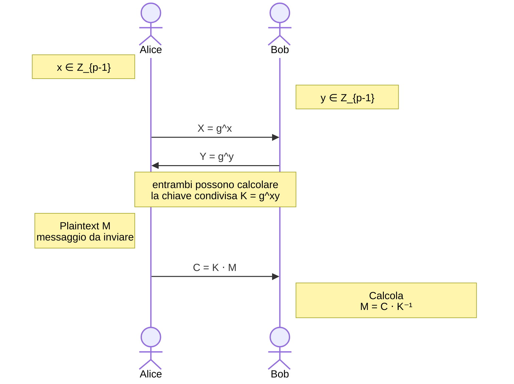
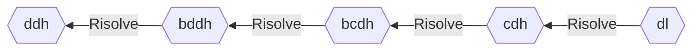

<h1 style="text-align: center">Introduzione alla crittografia asimmetrica </h1>

[TOC]


Contrariamente a quanto stabilito con la crittografia simmetrica, che prevede lo scambio di una chiave fra le due parti che intendono comunicare, la crittografica asimmetrica si basa sul concetto di usare una coppia di chiavi, pubblica e privata, proposto da Diffie-Hellman nel 1976. Perché lo schema funzioni deve essere impossibile, con delle risorse limitate, ricavare l'altra chiave conoscendone solo una. Tuttavia questa limitazione ci pone subito in un ambito che esclude il raggiungimento della perfetta sicurezza.
La crittografia a chiave pubblica si basa quindi sul gap computazionale tra algoritmi efficienti per determinate operazioni e intrattabilità delle operazioni inverse in assenza della chiave privata.
Mentre molte delle nozioni ad alto livello continueranno ad essere valide in questo ambito, la costruzione degli schemi e gli strumenti teorici utilizzati per dimostrare la loro efficacia sono profondamente diversi, basandosi molto spesso sull'intrattabilità computazionale.


## Funzioni unidirezionali

La crittografia asimmetrica si basa sul concetto di funzioni unidirezionali, cioè funzioni che siano facili da calcolare ma molto difficili da invertire. Più formalmente, definita $\mu$ come una funzione trascurabile, per cui $\forall c \ge 0, \ \exists k_c : \mu(k) \le k^{-c} \quad \forall k \ge k_c$, una funzione $f: \{0, 1\}^* \rightarrow \{0, 1\}^*$ è una unidirezionale se

- esiste un algoritmo efficiente che dato un $x \in \{0, 1\}^*$ calcoli $f(x)$
- per ogni algoritmo efficiente A esiste una funzione trascurabile $\mu_A$ tale che per $k$ sufficientemente grande $Pr[f(z) = y : x \in_R \{0, 1\}^*; f(x) = y; A(k, y) = z] \le \mu_A(k)$. In altre parole, la probabilità di invertire la funzione diventa trascurabilmente piccola


### Funzioni unidirezionali trapdoor

Si tratta di funzioni unidirezionali con la seguente proprietà: se si conosce una specifica informazione (trapdoor) esse divengono facili da invertire. Si tratta di primitive estremamente interessanti, poiché partendo da esse è possibile costruire cifrari in maniera semplice. 


## Schema di cifratura asimmetrico

Uno schema di cifratura asimmetrico è simile ad uno simmetrico se non per la presenza di due chiavi, una pubblica (**pk**) ed una privata o segreta (**sk**). La prima è usata per cifrare il messaggio, ed essendo pubblica questa operazione è consentita a chiunque senza particolari restrizioni, mentre la seconda, custodita gelosamente, permette di decifrare i messaggi cifrati con la corrispondente **sk**.

Uno schema di cifratura asimmetrico $\mathcal{AE} = (\mathcal{K}, \mathcal{E}, \mathcal{D})$ è una tripla di funzioni con i seguenti ruoli:

- $\mathcal{K}: \emptyset \rightarrow (\{0, 1\}^*, \{0, 1\}^*)$ è una funzione che non prende alcun input e restituisce una coppia di valori, cioè le chiavi **sk** e **pk**
- $\mathcal{E}: \{0, 1\}^* \times M  \rightarrow C$ è una funzione che prende in input una chiave pubblica **pk** ed un messaggio e restituisce il corrispondente crittotesto. Può essere randomizzato ma non a stati, poiché la comunicazione può giungere da più fonti e una sincronizzazione fra tutti i mittenti sarebbe inutilmente complicata se non irrealizzabile
- $\mathcal{D}: \{0, 1\}^* \times C \rightarrow M$ è una funzione che prende in input una chiave privata **sk** ed un crittotesto $\ne \bot$ e restituisce il messaggio originale corrispondente. Deterministico e privo di stati

Lo spazio dei messaggio associato a **pk** è $M = \{m : \mathcal{E}_{pk}(m) \ne \bot\}$. L'algoritmo di decifratura è corretto se $\forall m \in M, \forall c \in \mathcal{E}_{pk}(m) \quad \mathcal{D}_{sk}(c) = m$.


## Nozioni di sicurezza

Le due nozioni di sicurezza relative agli schemi di cifratura simmetrici erano relativi ad attacchi di tipo **cpa**[^1] e **cca**[^2]. Nel caso dei cifrari asimmetrici, si può fare una simile distinzione, tenendo però a mente che l'avversario ha sempre a disposizione **pk**, ed è quindi in grado di produrre il crittotesto di un messaggio in completa autonomia. Nel contesto asimmetrico, i **cca** diventano quindi ancora più rilevanti e più complessi da neutralizzare.


### Sicurezza contro attacchi a messaggio scelto (ind-cpa)

Si fissi uno schema di cifratura asimmetrico $\mathcal{AE} = (\mathcal{K}, \mathcal{E}, \mathcal{D})$ e si definisca una funzione $LR(x_0, x_1, b) = \begin{cases} x_0 & \text{se } b = 0\\ x_1 & \text{se } b = 1 \end{cases}$

Si consideri un avversario $A$ che riceve come input la **pk**. L'avversario $A$ ha disposizione un oracolo $\mathcal{E}_{pk}(LR(.,.,b))$, che cifra uno dei due messaggi che $A$ fornisce come input, a seconda del bit $b$.
L'obiettivo di $A$ è fornire in output un bit che rappresenta il suo tentativo di indovinare il bit utilizzato dalla funzione $LR$. 

Viene quindi definita la seguente coppia di esperimenti:

```pseudocode
ESP_{AE}^{ind-cpa-1}(A):
	(pk, sk) <-R- KeyGen()
	b <- A^{Enc_{pk}}(LR(.,.,1))}
	return b

ESP_{AE}^{ind-cpa-0}(A):
	(pk, sk) <-R- KeyGen()
	b <- A^{Enc_{pk}}(LR(.,.,0))}
	return b
```

La nozione di vantaggio in senso **ind-cpa** dell'avversario $A$ è così definita: 
$$
Adv_{\mathcal{AE}}^{ind-cpa}(A) = | Pr[ESP_{\mathcal{AE}}^{ind-cpa-1}(A) = 1] - Pr[ESP_{\mathcal{AE}}^{ind-cpa-0}(A) = 1] |
$$
Lo schema di cifratura asimmetrico $\mathcal{AE}$ è sicuro in senso **ind-cpa** se il vantaggio di ogni possibile avversario polinomialmente limitato è prossimo a 0.


### Sicurezza contro attacchi a crittotesto scelto (ind-cca)

Si fissi uno schema di cifratura asimmetrico $\mathcal{AE} = (\mathcal{K}, \mathcal{E}, \mathcal{D})$ e si definisca una funzione $LR(x_0, x_1, b) = \begin{cases} x_0 & \text{se } b = 0\\ x_1 & \text{se } b = 1 \end{cases}$

Si consideri un avversario $A$ che riceve come input la **pk**. L'avversario $A$ ha disposizione due oracoli: il primo $\mathcal{E}_{pk}(LR(.,.,b))$, che cifra uno dei due messaggi che $A$ fornisce come input, a seconda del bit $b$, il secondo $\mathcal{D}_{pk}(.)$ che prende in input un crittotesto e restituisce il messaggio che ha lo ha originato. 
L'obiettivo di $A$ è fornire in output un bit che rappresenta il suo tentativo di indovinare il bit utilizzato dalla funzione $LR$. 
Al fine di evitare soluzioni banali, si stabilisce che $A$ imbroglia se chiede al secondo oracolo la decifratura dell'output ottenuto dal primo.

 Viene quindi definita la seguente coppia di esperimenti:

```pseudocode
ESP_{AE}^{ind-cca-1}(A):
	(pk, sk) <-R- KeyGen()
	b <- A^{Enc_{pk}}(LR(.,.,1)), Dec_{sk}(.)}
	if A cheated:
		return 0
	return b

ESP_{AE}^{ind-cca-0}(A):
	(pk, sk) <-R- KeyGen()
	b <- A^{Enc_{pk}}(LR(.,.,0)), Dec_{sk}(.)}
	if A cheated:
		return 0
	return b
```

La nozione di vantaggio in senso **ind-cca** dell'avversario $A$ è così definita: 
$$
Adv_{\mathcal{AE}}^{ind-cxa}(A) = | Pr[ESP_{\mathcal{AE}}^{ind-cca-1}(A) = 1] - Pr[ESP_{\mathcal{AE}}^{ind-cca-0}(A) = 1] |
$$
Lo schema di cifratura asimmetrico $\mathcal{AE}$ è sicuro in senso **ind-cca** se il vantaggio di ogni possibile avversario polinomialmente limitato è prossimo a 0.


#### Non malleabilità

La sicurezza in senso **ind-cca** garantisce anche la non malleabilità dello schema di cifratura. Si consideri infatti $M$ lo spazio dei messaggi ed una funzione $F: M \rightarrow M$ facilmente computabile. Se lo schema $\mathcal{AE}$ fosse malleabile rispetto ad $F$, chiunque potrebbe calcolare $\mathcal{E}_{pk}(F(m))$ dati $\mathcal{E}_{pk}(m)$ ed $F$. Si può quindi definire una funzione $MAUL(\mathcal{E}_{pk}(m), F) = \mathcal{E}_{pk}(F(m))$.

Per vedere come questo fatto rompe l'esperimento, si consideri il seguente avversario:

```pseudocode
A(AE, F):
	(m_0, m_1) <-R- M
	c <- O_E(m_0, m_1)
	c` <- MAUL(c, F)
	m <- O_D(c`)
	if m == m_0:
		return 0
	return 1
```


## Vantaggio legato a query multiple

Negli esperimenti precedenti l'avversario ha la possibilità di effettuare un numero arbitrario $q_e$ di domande ad ogni oracolo. Si dimostra il seguente lemma:
$$
\exists A : \text{avversario che fa una singola domanda con tempo di esecuzione } t_e \\
\exists B : \text{avversario che fa } q_e \text{ domande con tempo di esecuzione } t_e\\
Adv^{ind-cpa}_{\mathcal{AE}}(B) \le q_e \cdot Adv^{ind-cpa}_{\mathcal{AE}}(A)
$$
Lo stesso dicasi per **ind-cca**. Ne segue che un cifrario asimmetrico per il quale è autorizzata una sola domanda ha una sicurezza paragonabile a quella di un sistema in cui sono autorizzate un numero arbitrario di domande.


## Cifratura ibrida

Nonostante si abbiano a disposizione cifrari asimmetrici molto sofisticati, nella pratica l'approccio che si preferisce è quello di una cifratura ibrida, che utilizza il cifrario asimmetrico per lo scambio della chiave per il cifrario simmetrico che verrà utilizzato da quel momento per l'effettiva comunicazione di messaggi.

Dati due schemi di cifratura $\mathcal{AE} = (\mathcal{K}^a, \mathcal{E}^a, \mathcal{D}^a), \mathcal{SE} = (\mathcal{K}^s, \mathcal{E}^s, \mathcal{D}^s)$  rispettivamente asimmetrico e simmetrico, si può definire uno schema di cifratura ibrido $\mathcal{HE} = (\mathcal{K}^a, \mathcal{E}^h, \mathcal{D}^h)$ che si comporta nella seguente maniera:

```pseudocode
Enc^h(pk, m):
	k <-R- K^s()
	c_s <- E^s(k, m)
	c_a <- E^a(pk, k)
	return (c_s, c_a)

Dec^h(sk, (C_s, c_a)):
	k <- Dec^a(sk, c_a)
	m <- Dev^s(k, c_s)
	return m
```

Il motivo di questa scelta è da ricercarsi nel costo in termini di tempo delle operazioni da affrontare, che nel caso di cifratura asimmetrica, sono ben più dispendiose.


### Sicurezza contro attacchi a messaggio scelto (cpa)

Siano $\mathcal{AE} = (\mathcal{K}^a, \mathcal{E}^a, \mathcal{D}^a), \mathcal{SE} = (\mathcal{K}^s, \mathcal{E}^s, \mathcal{D}^s)$  due schemi di cifratura asimmetrico e simmetrico e $\mathcal{HE} = (\mathcal{K}^a, \mathcal{E}^h, \mathcal{D}^h)$ lo schema ibrido risultante dalla loro combinazione.
$$
\exists A_{00,01} : \text{avversario che attacca } \mathcal{AE} \text{ con } q \text{ domande} \\
\exists A_{11,10} : \text{avversario che attacca } \mathcal{AE} \text{ con } q \text{ domande} \\
\exists A : \text{avversario che attacca } \mathcal{SE} \text{ con una sola domanda} \\
\exists B : \text{avversario che attacca } \mathcal{HE} \text{ in senso ind-cpa}\\

Adv^{ind-cpa}_{\mathcal{HE}}(B) \le Adv^{ind-cpa}_{\mathcal{AE}}(A_{00,01}) + Adv^{ind-cpa}_{\mathcal{AE}}(A_{11,10}) + Adv^{ind-cpa}_{\mathcal{SE}}(A)
$$
Poiché l'avversario $A$ è limitato ad una sola domanda, anche se lo schema di cifratura simmetrico non è particolarmente forte, lo schema ibrido potrebbe continuare ad essere sicuro. Un discorso simile può essere fatto per la sicurezza in senso **ind-cca**.


## Schema El Gamal

Sia $G$ un gruppo ciclico con generatore $g$, per cui $G = \{g^0, g^1, ..., g^{n-1}\}$, dove $n = |G|$ è l'ordine di $G$.

Si ricordino le funzioni
$$
DExp_{G,g}: Z_n \rightarrow G \quad \\
DExp(x) = g^x \\
\\
DLog_{G,g}: G \rightarrow Z_n  \\
DLog_{G,g}(g^x) = x
$$

La funzione $DExp_{G,g}$ è unidirezionale, stando alla congettura che ipotizza $DLog_{G,g}$ sia non trattabile nei giusti gruppo $G$, come ad esempio $G=Z_p^*$, dove $p$ è un numero primo e $p-1$ ha un fattore di scomposizione molto grande.

Ipotizziamo quindi uno scambio di messaggi in cui il mittente e il destinatario si procurano entrambi due valori $x, y \in Z_{p-1}$. Entrambi calcolano poi rispettivamente $X=g^x, Y=g^y$ e si scambiano questi risultati così da poter calcolare $K = g^{xy}$, avendo tutti gli strumenti per farlo.
Quando il mittente vuole mandare un messaggio $M \in G$, gli basta calcolare $C = M \cdot K$ ed inviare questo valore al destinatario, che potrà recuperare il messaggio originale calcolando $M = C \cdot K^{-1}$.



In questo schema un potenziale attaccante può avere accesso solo ai valori $X, Y, C$. Poiché abbiamo ipotizzato che $DLog_{G,g}$ sia intrattabile in questo gruppo, non può utilizzare $X, Y$ per calcolare $x, y$. Se anche il `problema computazionale Diffie-Hellman`[^3] è intrattabile, cosa che possiamo assumere dato che l'unico modo per risolverlo sembra essere quello di risolvere il `logaritmo discreto`, allora l'avversario non può nemmeno ottenere $K$ conoscendo solo $X, Y$.


### Definizione El-Gamal

Sia $G$ un gruppo ciclico di ordine $n$ e con generatore $g$. Lo schema di cifratura asimmetrico **El-Gamal** $\mathcal{AE}_{EG} = (\mathcal{K}, \mathcal{E}, \mathcal{D})$ è costruito nella seguente maniera:

```pseudocode
K():
	x <-R- Z_n
	X <- g**x
	return (X, x)

E(X, M): /* con X chiave pubblica del mittente - M messaggio da inviare */
	if M not in G:
		return "error"
	y <-R- Z_n
	Y <- g**y
	K <- X**y
	C <- M * K
	return (Y, C)

D(x, Y, C): /* con x esponente privato - Y e C ricevuti dal mittente */
	K <- Y**x
	M <- C/K
	return M
```


Lo schma **El-Gamal** è sicuro in senso **ind-cpa** se si utilizza un gruppo in cui il `problema decisionale Diffie-Hellman`[^4] è intrattabile. Per le sue proprietà di malleabilità rispetto alla moltiplicazione, invece, non può mai essere sicuro in sendo **ind-cca**.


## Schema Pallier

### Preliminari matematici

Un elemento $y \in Z_{N^2}^*$ e’ detto $\text{N-residuo} \mod N^2$ se $\exists x \in Z_{N^2}^*: y \equiv x^N \mod N^2$. Un elemento N-residuo ammette N radici N-esime distinte.

Si consideri l'insieme $T = \{(1+xN) \mod N^2 : x \in Z_N \}$. Ogni elemento $z \in T: z^N \equiv 1 \mod N^2$.
L'ordine di $Z_{N^2}^*$ è $\phi(N^2) = (p^2 - p)(q^2 - q) = \phi(N)\cdot N$. Dunque $\forall x \in Z_{N^2}$ si ha che $x^{\phi(N^2)} \equiv x^{\phi(N)\cdot N} \equiv 1 \mod N^2$.

Ogni elemento $y \in Z_{N^2}^*$ può inoltre essere scritto come $(1 + xN)w^N$, con $x \in Z_N, w \in Z_{N^2}^*$. Questo ci consente di divirere $Z_{N^2}^*$ in classi di equivalenza $a \equiv b$ se $ab^{-1}$ è un N-Residuo in $Z_{N^2}^*$.


### Problema della N-residuosità

Dato un elemento $w \xleftarrow{$} Z_{N^2}^*$, determinare se $w$ è un elemento N-residuo o meno è il `problema della N-residuosità`. Si congettura che, se la fattorizzazione di $N$ è ignota, il problema è intrattabile.

Per descrivere formalmente questo problema si può utilizzare il seguente coppia di esperimenti.

Sia $G = Z_{N^2}^*$ un gruppo ciclico di ordine $m = \phi(N^2) = \phi(N) \cdot N$ e $g$ un generatore di $G$. Si consideri quindi l'elemento $x \xleftarrow{$} G$.

Un avversario A riceve come input, a seconda del mondo in cui si trova, un input $W$ così definito:
$$
W = \begin{cases}
x^N \mod N^2 & \text{se siamo nel ESP-} 1\\
\xleftarrow{$}Z_{N^2}^* & \text{se siamo nel ESP-} 0\\
\end{cases}
$$


 L'obiettivo di A è quello di determinare in quale esperimento si trova tramite un bit di output.

```pseudocode
ESP_N^{DCRA-1}(A):
	x <-R- G
	w <- x**N % N**2
	d <- A(w)
	return d

ESP_N^{DCRA-1}(A):
	w <-R- G
	d <- A(w)
	return d
```

La nozione di vantaggio in senso **dcra** dell'avversario A è così definita: 
$$
Adv_{N}^{dcra}(A) = | Pr[ESP_{N}^{dcra-1}(A) = 1] - Pr[ESP_{N}^{dcra-0}(A) = 1] |
$$
Risolvere il `problema della N-residuosità` è intrattabile se il vantaggio di ogni possibile avversario polinomialmente limitato è prossimo a 0.

Questo non è vero se l'avversario conosce la fattorizzazione di $N$, da cui può ricavare $\phi(N)$, valore che è possibile usare per discernere facilmente i valori N-Residui.


### Definizione Paillier

Sia $G = Z_{N^2}^*$ un gruppo con generatore $g$. Lo schema di cifratura asimmetrico **Paillier** $\mathcal{AE}_{EG} = (\mathcal{K}, \mathcal{E}, \mathcal{D})$ è costruito nella seguente maniera:

$\mathcal{K}$ è molto simile ad **RSA**, in quanto non prende input e restituisce un $N = pq$, con $N$ che diventa la chiave pubblia e $p, q$ mantenuti segreti. Non serve calcolare alcun esponente aggiuntivo, al contrario che con **RSA**.
Lo spazio dei messaggi è $Z_n$, lo spazio dei crittotesti $Z_{N^2}^*$.

```pseudocode
ENC(N, M):
	y <-R- G
	C <- (1 + m*N) * y**N % N**2
	return C

DEC(p, q, C):
	phi <- (p - 1) * (q - 1)
	m <- c**phi
	d <- MOD-INV(phi, N)
	m <- m**d
	m <- (m - 1)/N
	return m
```

La decifratura di questo cifrario è un po' più complicata, ma andando passo passo:
$$
\text{Ricordando che il crittotesto in input} \\
c = (1 + mN)y^N \mod N^2 \\
\\
\text{Si calcola } c^{\phi(N)} \\
c^{\phi(N)} = ((1 + mN)y^N)^{\phi(N)} \mod N^2 = (1 + mN)^{\phi(N)} \mod N^2 \\
\\
\text{Tramite la funzione MOD-INV}(\phi(N), N)\text{ si calcola l'inverso di }\phi(N)\text{ in } Z_n \rightarrow d \\
(c^{\phi(N)})^d = ((1 + mN)^{\phi(N)})^d \mod N^2 = (1 + mN) \mod N^2 \\
\\
\text{Per finire, si ottiene }m\text{, il messaggio originale} \\
m = \frac{(c^{\phi(N)})^d - 1}{N} = \frac{(1 + mN) - 1}{N}
$$
La cosa interessante del cifrario **Paillier** è che è additivamente omoformico: $\mathcal{E}_N(m_1) + \mathcal{E}_N(m_2) = \mathcal{E}_N(m_1 + m_2)$. Tale proprietà è molto utile in pratica, come ad esempio per il voto elettronico.


### Sicurezza dello schema Paillier

La sicurezza in senso **ind-cpa** dello schema **Paillier** è maggiorata dal problema della N-residuosità in questa maniera: $Adv_{N, Paillier}^{inc-cpa}(A) \le 2Adv_{N}^{dcra}(B)$.
In altre parole, se un avversario è in grado di rendere insicuro lo schema **Paillier**, anche il problema della N-Residuosità diventa trattabile.
Segue un esempio di un avversario B che cerca di risolvere il `problema della N-Residuosità` utilizzando un avversario A che attacca lo schema **Paillier**.

```pseudocode
B(N, w): /* w è un quadrato residuo? */
	(m_0, m_1, st) <- A(N) /* st è lo stato dell'avversario A */
	b <-R- {0, 1}
	c <- (1 + m_b*N)*w % N**2 /* cifratura valida dello schema Paillier, ammesso che w sia un N-Residuo */
	b` <- A(st, c)
	if b` == b:
		return 1
	return 0
```


## OAEP (Optimal Asymmetric Encryption Padding)

Proposto inizialmente nel 1994, **OAEP** è un metodo per costruire un cifrario sicuro a partire da una qualsiasi permutazione trapdoor con qualche proprietà peculiare. Nel 2001, però, è stato scoperto un errore nella dimostrazione, che è stato possibile aggirare solo per **RSA**.

**RSA-OAEP** è di fatto lo standard per quanto riguarda la cifratura **RSA**. La dimostrazione di sicurezza rimane comuque, in un certo senso, euristica. Si potrebbe dimostrare la sua sicurezza in maniera matematica solo nel cosiddetto *Random Oracle model*.

Nel modello *RO*, sarebbe necessario avere una funzione hash casuale, e si ipotizza che anche utilizzando una funzione hash lo schema rimanga sicuro. Tale ipotesi è dimostrabilmente falsa, ma nonostante ciò lo schema viene comunque utilizzato.


### Preliminari RSA-OAEP

Sia $k$ la taglia del modulo **RSA** da usare, e $k_0, k_1: k_0 + k_1 \lt k$. Lo spazio dei messaggi è $\{0, 1\}^n$, con $n = k - k_0 - k_1$.
Abbiamo anche bisogno di due funzioni hash:
$$
G: \{0, 1\}^{k_0} \rightarrow \{0, 1\}^{n + k_1} \\
H: \{0, 1\}^{n + k_1} \rightarrow \{0, 1\}^{k_0}
$$
L'algoritmo per la generazione delle chiavi è lo stesso usato da **RSA**.

```pseudocode
ENC(N, m):
	r <-R- {0, 1}^{k_0}
	X <- G(r) xor (m||0^k_1) /* |X| = n - k0 */
	Y <- H(s) xor r /* |Y| = k0 */
	W <- X||Y  /* |W| = n */
	y <- RSA(W)
	return 
	
DEC(N, c):
	W <- INV-RSA(c)
	X || Y <- W /* |X| = n - k0, |Y| = k0 */
	r <- H(X) xor Y
	z <- G(r) xor X
	m || v <- z /* |m| = n - k1 - k0, |v| = k1 */
	if v != 0:
		return "error"
	return m
```

Di seguito lo schema riassuntivo di `ENC`.

<center>
<svg xmlns="http://www.w3.org/2000/svg" xmlns:xlink="http://www.w3.org/1999/xlink" version="1.1" width="396px" viewBox="-0.5 -0.5 396 471" style="max-width:100%;max-height:471px;"><defs/><g><path d="M 50 30 L 50 97.52 Q 50 107.52 60 107.52 L 110 107.52 Q 120 107.52 120 117.52 L 120 185" fill="none" stroke="rgb(0, 0, 0)" stroke-miterlimit="10" pointer-events="stroke"/><rect x="0" y="0" width="100" height="30" rx="4.5" ry="4.5" fill="#cce5ff" stroke="#36393d" pointer-events="all"/><g transform="translate(-0.5 -0.5)"><switch><foreignObject pointer-events="none" width="100%" height="100%" requiredFeatures="http://www.w3.org/TR/SVG11/feature#Extensibility" style="overflow: visible; text-align: left;"><div xmlns="http://www.w3.org/1999/xhtml" style="display: flex; align-items: unsafe center; justify-content: unsafe center; width: 98px; height: 1px; padding-top: 15px; margin-left: 1px;"><div data-drawio-colors="color: rgb(0, 0, 0); " style="box-sizing: border-box; font-size: 0px; text-align: center;"><div style="display: inline-block; font-size: 12px; font-family: Helvetica; color: rgb(0, 0, 0); line-height: 1.2; pointer-events: all; white-space: normal; overflow-wrap: normal;"><b><font style="font-size: 20px">m</font></b></div></div></div></foreignObject><text x="50" y="19" fill="rgb(0, 0, 0)" font-family="Helvetica" font-size="12px" text-anchor="middle">m</text></switch></g><path d="M 190 30 L 190 97.52 Q 190 107.52 180 107.52 L 130 107.52 Q 120 107.52 120 117.52 L 120 178.63" fill="none" stroke="rgb(0, 0, 0)" stroke-miterlimit="10" pointer-events="stroke"/><path d="M 120 183.88 L 116.5 176.88 L 120 178.63 L 123.5 176.88 Z" fill="rgb(0, 0, 0)" stroke="rgb(0, 0, 0)" stroke-miterlimit="10" pointer-events="all"/><rect x="140" y="0" width="100" height="30" rx="4.5" ry="4.5" fill="#d5e8d4" stroke="#82b366" pointer-events="all"/><g transform="translate(-0.5 -0.5)"><switch><foreignObject pointer-events="none" width="100%" height="100%" requiredFeatures="http://www.w3.org/TR/SVG11/feature#Extensibility" style="overflow: visible; text-align: left;"><div xmlns="http://www.w3.org/1999/xhtml" style="display: flex; align-items: unsafe center; justify-content: unsafe center; width: 98px; height: 1px; padding-top: 15px; margin-left: 141px;"><div data-drawio-colors="color: rgb(0, 0, 0); " style="box-sizing: border-box; font-size: 0px; text-align: center;"><div style="display: inline-block; font-size: 12px; font-family: Helvetica; color: rgb(0, 0, 0); line-height: 1.2; pointer-events: all; white-space: normal; overflow-wrap: normal;"><b><font style="font-size: 20px">000</font></b></div></div></div></foreignObject><text x="190" y="19" fill="rgb(0, 0, 0)" font-family="Helvetica" font-size="12px" text-anchor="middle">000</text></switch></g><path d="M 330 30 L 330 190 Q 330 200 320 200 L 256.37 200" fill="none" stroke="rgb(0, 0, 0)" stroke-miterlimit="10" pointer-events="stroke"/><path d="M 251.12 200 L 258.12 196.5 L 256.37 200 L 258.12 203.5 Z" fill="rgb(0, 0, 0)" stroke="rgb(0, 0, 0)" stroke-miterlimit="10" pointer-events="all"/><path d="M 330 30 L 330 259.63" fill="none" stroke="rgb(0, 0, 0)" stroke-miterlimit="10" pointer-events="stroke"/><path d="M 330 264.88 L 326.5 257.88 L 330 259.63 L 333.5 257.88 Z" fill="rgb(0, 0, 0)" stroke="rgb(0, 0, 0)" stroke-miterlimit="10" pointer-events="all"/><rect x="280" y="0" width="100" height="30" rx="4.5" ry="4.5" fill="#fff2cc" stroke="#d6b656" pointer-events="all"/><g transform="translate(-0.5 -0.5)"><switch><foreignObject pointer-events="none" width="100%" height="100%" requiredFeatures="http://www.w3.org/TR/SVG11/feature#Extensibility" style="overflow: visible; text-align: left;"><div xmlns="http://www.w3.org/1999/xhtml" style="display: flex; align-items: unsafe center; justify-content: unsafe center; width: 98px; height: 1px; padding-top: 15px; margin-left: 281px;"><div data-drawio-colors="color: rgb(0, 0, 0); " style="box-sizing: border-box; font-size: 0px; text-align: center;"><div style="display: inline-block; font-size: 20px; font-family: Helvetica; color: rgb(0, 0, 0); line-height: 1.2; pointer-events: all; white-space: normal; overflow-wrap: normal;"><b style="font-size: 20px">r</b></div></div></div></foreignObject><text x="330" y="21" fill="rgb(0, 0, 0)" font-family="Helvetica" font-size="20px" text-anchor="middle">r</text></switch></g><path d="M 120 215 L 120 343.63" fill="none" stroke="rgb(0, 0, 0)" stroke-miterlimit="10" pointer-events="stroke"/><path d="M 120 348.88 L 116.5 341.88 L 120 343.63 L 123.5 341.88 Z" fill="rgb(0, 0, 0)" stroke="rgb(0, 0, 0)" stroke-miterlimit="10" pointer-events="all"/><ellipse cx="120" cy="200" rx="15" ry="15" fill="#d0cee2" stroke="#56517e" pointer-events="all"/><path d="M 105 200 L 135 200" fill="none" stroke="#56517e" stroke-miterlimit="10" pointer-events="all"/><path d="M 120 185 L 120 215" fill="none" stroke="#56517e" stroke-miterlimit="10" pointer-events="all"/><path d="M 200 200 L 141.37 200" fill="none" stroke="rgb(0, 0, 0)" stroke-miterlimit="10" pointer-events="stroke"/><path d="M 136.12 200 L 143.12 196.5 L 141.37 200 L 143.12 203.5 Z" fill="rgb(0, 0, 0)" stroke="rgb(0, 0, 0)" stroke-miterlimit="10" pointer-events="all"/><ellipse cx="225" cy="200" rx="25" ry="25" fill="#f8cecc" stroke="#b85450" pointer-events="all"/><g transform="translate(-0.5 -0.5)"><switch><foreignObject pointer-events="none" width="100%" height="100%" requiredFeatures="http://www.w3.org/TR/SVG11/feature#Extensibility" style="overflow: visible; text-align: left;"><div xmlns="http://www.w3.org/1999/xhtml" style="display: flex; align-items: unsafe center; justify-content: unsafe center; width: 48px; height: 1px; padding-top: 200px; margin-left: 201px;"><div data-drawio-colors="color: rgb(0, 0, 0); " style="box-sizing: border-box; font-size: 0px; text-align: center;"><div style="display: inline-block; font-size: 20px; font-family: Helvetica; color: rgb(0, 0, 0); line-height: 1.2; pointer-events: all; white-space: normal; overflow-wrap: normal;">G</div></div></div></foreignObject><text x="225" y="206" fill="rgb(0, 0, 0)" font-family="Helvetica" font-size="20px" text-anchor="middle">G</text></switch></g><path d="M 120 380 L 120 390 Q 120 400 130 400 L 215 400 Q 225 400 225 410 L 225 433.63" fill="none" stroke="rgb(0, 0, 0)" stroke-miterlimit="10" pointer-events="stroke"/><path d="M 225 438.88 L 221.5 431.88 L 225 433.63 L 228.5 431.88 Z" fill="rgb(0, 0, 0)" stroke="rgb(0, 0, 0)" stroke-miterlimit="10" pointer-events="all"/><rect x="0" y="350" width="240" height="30" rx="4.5" ry="4.5" fill="#dae8fc" stroke="#6c8ebf" pointer-events="all"/><g transform="translate(-0.5 -0.5)"><switch><foreignObject pointer-events="none" width="100%" height="100%" requiredFeatures="http://www.w3.org/TR/SVG11/feature#Extensibility" style="overflow: visible; text-align: left;"><div xmlns="http://www.w3.org/1999/xhtml" style="display: flex; align-items: unsafe center; justify-content: unsafe center; width: 238px; height: 1px; padding-top: 365px; margin-left: 1px;"><div data-drawio-colors="color: rgb(0, 0, 0); " style="box-sizing: border-box; font-size: 0px; text-align: center;"><div style="display: inline-block; font-size: 12px; font-family: Helvetica; color: rgb(0, 0, 0); line-height: 1.2; pointer-events: all; white-space: normal; overflow-wrap: normal;"><b><font style="font-size: 20px">X</font></b></div></div></div></foreignObject><text x="120" y="369" fill="rgb(0, 0, 0)" font-family="Helvetica" font-size="12px" text-anchor="middle">X</text></switch></g><path d="M 330 380 L 330 390 Q 330 400 320 400 L 235 400 Q 225 400 225 410 L 225 433.63" fill="none" stroke="rgb(0, 0, 0)" stroke-miterlimit="10" pointer-events="stroke"/><path d="M 225 438.88 L 221.5 431.88 L 225 433.63 L 228.5 431.88 Z" fill="rgb(0, 0, 0)" stroke="rgb(0, 0, 0)" stroke-miterlimit="10" pointer-events="all"/><rect x="280" y="350" width="100" height="30" rx="4.5" ry="4.5" fill="#fff2cc" stroke="#d6b656" pointer-events="all"/><g transform="translate(-0.5 -0.5)"><switch><foreignObject pointer-events="none" width="100%" height="100%" requiredFeatures="http://www.w3.org/TR/SVG11/feature#Extensibility" style="overflow: visible; text-align: left;"><div xmlns="http://www.w3.org/1999/xhtml" style="display: flex; align-items: unsafe center; justify-content: unsafe center; width: 98px; height: 1px; padding-top: 365px; margin-left: 281px;"><div data-drawio-colors="color: rgb(0, 0, 0); " style="box-sizing: border-box; font-size: 0px; text-align: center;"><div style="display: inline-block; font-size: 20px; font-family: Helvetica; color: rgb(0, 0, 0); line-height: 1.2; pointer-events: all; white-space: normal; overflow-wrap: normal;"><b style="font-size: 20px">Y</b></div></div></div></foreignObject><text x="330" y="371" fill="rgb(0, 0, 0)" font-family="Helvetica" font-size="20px" text-anchor="middle">Y</text></switch></g><path d="M 330 296 L 330 343.63" fill="none" stroke="rgb(0, 0, 0)" stroke-miterlimit="10" pointer-events="stroke"/><path d="M 330 348.88 L 326.5 341.88 L 330 343.63 L 333.5 341.88 Z" fill="rgb(0, 0, 0)" stroke="rgb(0, 0, 0)" stroke-miterlimit="10" pointer-events="all"/><ellipse cx="330" cy="281" rx="15" ry="15" fill="#d0cee2" stroke="#56517e" pointer-events="all"/><path d="M 315 281 L 345 281" fill="none" stroke="#56517e" stroke-miterlimit="10" pointer-events="all"/><path d="M 330 266 L 330 296" fill="none" stroke="#56517e" stroke-miterlimit="10" pointer-events="all"/><path d="M 120 281 L 193.63 281" fill="none" stroke="rgb(0, 0, 0)" stroke-miterlimit="10" pointer-events="stroke"/><path d="M 198.88 281 L 191.88 284.5 L 193.63 281 L 191.88 277.5 Z" fill="rgb(0, 0, 0)" stroke="rgb(0, 0, 0)" stroke-miterlimit="10" pointer-events="all"/><path d="M 250 281 L 308.63 281" fill="none" stroke="rgb(0, 0, 0)" stroke-miterlimit="10" pointer-events="stroke"/><path d="M 313.88 281 L 306.88 284.5 L 308.63 281 L 306.88 277.5 Z" fill="rgb(0, 0, 0)" stroke="rgb(0, 0, 0)" stroke-miterlimit="10" pointer-events="all"/><ellipse cx="225" cy="281" rx="25" ry="25" fill="#f8cecc" stroke="#b85450" pointer-events="all"/><g transform="translate(-0.5 -0.5)"><switch><foreignObject pointer-events="none" width="100%" height="100%" requiredFeatures="http://www.w3.org/TR/SVG11/feature#Extensibility" style="overflow: visible; text-align: left;"><div xmlns="http://www.w3.org/1999/xhtml" style="display: flex; align-items: unsafe center; justify-content: unsafe center; width: 48px; height: 1px; padding-top: 281px; margin-left: 201px;"><div data-drawio-colors="color: rgb(0, 0, 0); " style="box-sizing: border-box; font-size: 0px; text-align: center;"><div style="display: inline-block; font-size: 20px; font-family: Helvetica; color: rgb(0, 0, 0); line-height: 1.2; pointer-events: all; white-space: normal; overflow-wrap: normal;">H</div></div></div></foreignObject><text x="225" y="287" fill="rgb(0, 0, 0)" font-family="Helvetica" font-size="20px" text-anchor="middle">H</text></switch></g><rect x="60" y="40" width="60" height="20" rx="3" ry="3" fill="rgb(255, 255, 255)" stroke="rgb(0, 0, 0)" pointer-events="all"/><path d="M 66 40 L 66 60 M 114 40 L 114 60" fill="none" stroke="rgb(0, 0, 0)" stroke-miterlimit="10" pointer-events="all"/><g transform="translate(-0.5 -0.5)"><switch><foreignObject pointer-events="none" width="100%" height="100%" requiredFeatures="http://www.w3.org/TR/SVG11/feature#Extensibility" style="overflow: visible; text-align: left;"><div xmlns="http://www.w3.org/1999/xhtml" style="display: flex; align-items: unsafe center; justify-content: unsafe center; width: 46px; height: 1px; padding-top: 50px; margin-left: 67px;"><div data-drawio-colors="color: rgb(0, 0, 0); " style="box-sizing: border-box; font-size: 0px; text-align: center;"><div style="display: inline-block; font-size: 8px; font-family: Helvetica; color: rgb(0, 0, 0); line-height: 1.2; pointer-events: all; white-space: normal; overflow-wrap: normal;"><font style="font-size: 8px">n - k0 - k1</font></div></div></div></foreignObject><text x="90" y="52" fill="rgb(0, 0, 0)" font-family="Helvetica" font-size="8px" text-anchor="middle">n - k0 - k1</text></switch></g><rect x="200" y="40" width="50" height="20" rx="3" ry="3" fill="rgb(255, 255, 255)" stroke="rgb(0, 0, 0)" pointer-events="all"/><path d="M 205 40 L 205 60 M 245 40 L 245 60" fill="none" stroke="rgb(0, 0, 0)" stroke-miterlimit="10" pointer-events="all"/><g transform="translate(-0.5 -0.5)"><switch><foreignObject pointer-events="none" width="100%" height="100%" requiredFeatures="http://www.w3.org/TR/SVG11/feature#Extensibility" style="overflow: visible; text-align: left;"><div xmlns="http://www.w3.org/1999/xhtml" style="display: flex; align-items: unsafe center; justify-content: unsafe center; width: 38px; height: 1px; padding-top: 50px; margin-left: 206px;"><div data-drawio-colors="color: rgb(0, 0, 0); " style="box-sizing: border-box; font-size: 0px; text-align: center;"><div style="display: inline-block; font-size: 8px; font-family: Helvetica; color: rgb(0, 0, 0); line-height: 1.2; pointer-events: all; white-space: normal; overflow-wrap: normal;"><font style="font-size: 8px">k1</font></div></div></div></foreignObject><text x="225" y="52" fill="rgb(0, 0, 0)" font-family="Helvetica" font-size="8px" text-anchor="middle">k1</text></switch></g><rect x="130" y="120" width="50" height="20" rx="3" ry="3" fill="rgb(255, 255, 255)" stroke="rgb(0, 0, 0)" pointer-events="all"/><path d="M 135 120 L 135 140 M 175 120 L 175 140" fill="none" stroke="rgb(0, 0, 0)" stroke-miterlimit="10" pointer-events="all"/><g transform="translate(-0.5 -0.5)"><switch><foreignObject pointer-events="none" width="100%" height="100%" requiredFeatures="http://www.w3.org/TR/SVG11/feature#Extensibility" style="overflow: visible; text-align: left;"><div xmlns="http://www.w3.org/1999/xhtml" style="display: flex; align-items: unsafe center; justify-content: unsafe center; width: 38px; height: 1px; padding-top: 130px; margin-left: 136px;"><div data-drawio-colors="color: rgb(0, 0, 0); " style="box-sizing: border-box; font-size: 0px; text-align: center;"><div style="display: inline-block; font-size: 8px; font-family: Helvetica; color: rgb(0, 0, 0); line-height: 1.2; pointer-events: all; white-space: normal; overflow-wrap: normal;"><font style="font-size: 8px">n - k0</font></div></div></div></foreignObject><text x="155" y="132" fill="rgb(0, 0, 0)" font-family="Helvetica" font-size="8px" text-anchor="middle">n - k0</text></switch></g><rect x="130" y="320" width="50" height="20" rx="3" ry="3" fill="rgb(255, 255, 255)" stroke="rgb(0, 0, 0)" pointer-events="all"/><path d="M 135 320 L 135 340 M 175 320 L 175 340" fill="none" stroke="rgb(0, 0, 0)" stroke-miterlimit="10" pointer-events="all"/><g transform="translate(-0.5 -0.5)"><switch><foreignObject pointer-events="none" width="100%" height="100%" requiredFeatures="http://www.w3.org/TR/SVG11/feature#Extensibility" style="overflow: visible; text-align: left;"><div xmlns="http://www.w3.org/1999/xhtml" style="display: flex; align-items: unsafe center; justify-content: unsafe center; width: 38px; height: 1px; padding-top: 330px; margin-left: 136px;"><div data-drawio-colors="color: rgb(0, 0, 0); " style="box-sizing: border-box; font-size: 0px; text-align: center;"><div style="display: inline-block; font-size: 8px; font-family: Helvetica; color: rgb(0, 0, 0); line-height: 1.2; pointer-events: all; white-space: normal; overflow-wrap: normal;"><font style="font-size: 8px">n - k0</font></div></div></div></foreignObject><text x="155" y="332" fill="rgb(0, 0, 0)" font-family="Helvetica" font-size="8px" text-anchor="middle">n - k0</text></switch></g><rect x="345" y="320" width="50" height="20" rx="3" ry="3" fill="rgb(255, 255, 255)" stroke="rgb(0, 0, 0)" pointer-events="all"/><path d="M 350 320 L 350 340 M 390 320 L 390 340" fill="none" stroke="rgb(0, 0, 0)" stroke-miterlimit="10" pointer-events="all"/><g transform="translate(-0.5 -0.5)"><switch><foreignObject pointer-events="none" width="100%" height="100%" requiredFeatures="http://www.w3.org/TR/SVG11/feature#Extensibility" style="overflow: visible; text-align: left;"><div xmlns="http://www.w3.org/1999/xhtml" style="display: flex; align-items: unsafe center; justify-content: unsafe center; width: 38px; height: 1px; padding-top: 330px; margin-left: 351px;"><div data-drawio-colors="color: rgb(0, 0, 0); " style="box-sizing: border-box; font-size: 0px; text-align: center;"><div style="display: inline-block; font-size: 8px; font-family: Helvetica; color: rgb(0, 0, 0); line-height: 1.2; pointer-events: all; white-space: normal; overflow-wrap: normal;">k0</div></div></div></foreignObject><text x="370" y="332" fill="rgb(0, 0, 0)" font-family="Helvetica" font-size="8px" text-anchor="middle">k0</text></switch></g><rect x="340" y="40" width="50" height="20" rx="3" ry="3" fill="rgb(255, 255, 255)" stroke="rgb(0, 0, 0)" pointer-events="all"/><path d="M 345 40 L 345 60 M 385 40 L 385 60" fill="none" stroke="rgb(0, 0, 0)" stroke-miterlimit="10" pointer-events="all"/><g transform="translate(-0.5 -0.5)"><switch><foreignObject pointer-events="none" width="100%" height="100%" requiredFeatures="http://www.w3.org/TR/SVG11/feature#Extensibility" style="overflow: visible; text-align: left;"><div xmlns="http://www.w3.org/1999/xhtml" style="display: flex; align-items: unsafe center; justify-content: unsafe center; width: 38px; height: 1px; padding-top: 50px; margin-left: 346px;"><div data-drawio-colors="color: rgb(0, 0, 0); " style="box-sizing: border-box; font-size: 0px; text-align: center;"><div style="display: inline-block; font-size: 8px; font-family: Helvetica; color: rgb(0, 0, 0); line-height: 1.2; pointer-events: all; white-space: normal; overflow-wrap: normal;">k0</div></div></div></foreignObject><text x="365" y="52" fill="rgb(0, 0, 0)" font-family="Helvetica" font-size="8px" text-anchor="middle">k0</text></switch></g><rect x="175" y="440" width="100" height="30" rx="4.5" ry="4.5" fill="#fff2cc" stroke="#d6b656" pointer-events="all"/><g transform="translate(-0.5 -0.5)"><switch><foreignObject pointer-events="none" width="100%" height="100%" requiredFeatures="http://www.w3.org/TR/SVG11/feature#Extensibility" style="overflow: visible; text-align: left;"><div xmlns="http://www.w3.org/1999/xhtml" style="display: flex; align-items: unsafe center; justify-content: unsafe center; width: 98px; height: 1px; padding-top: 455px; margin-left: 176px;"><div data-drawio-colors="color: rgb(0, 0, 0); " style="box-sizing: border-box; font-size: 0px; text-align: center;"><div style="display: inline-block; font-size: 20px; font-family: Helvetica; color: rgb(0, 0, 0); line-height: 1.2; pointer-events: all; white-space: normal; overflow-wrap: normal;"><b style="font-size: 20px">W</b></div></div></div></foreignObject><text x="225" y="461" fill="rgb(0, 0, 0)" font-family="Helvetica" font-size="20px" text-anchor="middle">W</text></switch></g><rect x="240" y="410" width="50" height="20" rx="3" ry="3" fill="rgb(255, 255, 255)" stroke="rgb(0, 0, 0)" pointer-events="all"/><path d="M 245 410 L 245 430 M 285 410 L 285 430" fill="none" stroke="rgb(0, 0, 0)" stroke-miterlimit="10" pointer-events="all"/><g transform="translate(-0.5 -0.5)"><switch><foreignObject pointer-events="none" width="100%" height="100%" requiredFeatures="http://www.w3.org/TR/SVG11/feature#Extensibility" style="overflow: visible; text-align: left;"><div xmlns="http://www.w3.org/1999/xhtml" style="display: flex; align-items: unsafe center; justify-content: unsafe center; width: 38px; height: 1px; padding-top: 420px; margin-left: 246px;"><div data-drawio-colors="color: rgb(0, 0, 0); " style="box-sizing: border-box; font-size: 0px; text-align: center;"><div style="display: inline-block; font-size: 8px; font-family: Helvetica; color: rgb(0, 0, 0); line-height: 1.2; pointer-events: all; white-space: normal; overflow-wrap: normal;">n</div></div></div></foreignObject><text x="265" y="422" fill="rgb(0, 0, 0)" font-family="Helvetica" font-size="8px" text-anchor="middle">n</text></switch></g></g><switch><g requiredFeatures="http://www.w3.org/TR/SVG11/feature#Extensibility"/><a transform="translate(0,-5)" xlink:href="https://www.diagrams.net/doc/faq/svg-export-text-problems" target="_blank"><text text-anchor="middle" font-size="10px" x="50%" y="100%">Text is not SVG - cannot display</text></a></switch></svg>
</center>


## Identity based encription

L'obiettivo è quello di utilizzare una qualsiasi stirnga come chiave pubblica in uno schema di cifratura asimmetrico.Questo vuol dire che il mittente è in grado di inviare messaggi ancora prima che il ricevente abbia generato la corrispondente chiave. Inoltre è possibile realizzare facilmente chiavi pubbliche con una scadenza, ad esempio aggiungento il timestamp nella chiave.


### Funzioni bilineari

Siano $G_1, G_2, G_T$ dei gruppi con le seguenti proprietà:

- $G_1, G_2$ sono gruppi di ordine $q$ primo. $G_1$ è generato da $P$, $G_2$ da $P'$
- Esiste un isomorfismo $p: G_2 \rightarrow G_1, \ p(P') = p$
- Esiste una mappa bilineare $e: G_1 \times G_2 \rightarrow G_T$
- Le operazioni in tutti i gruppi devono essere efficienti

$$
\text{Bilinearità: } \forall U \in G_1, \ V \in G_2, \ a,b\in \Z \\
e(U^a, V^b) = e(U, V)^{ab} \\
\text{Non deve essere degenere: } e(P, P') \ne \bold{1}_{G_T}
$$


### Definizione formale

Uno schema di identity based encription è una quadrupla così definita: $\mathcal{IBE} = (\mathcal{Setup}, \mathcal{KeyDer}, \mathcal{Enc}, \mathcal{Dec})$. 

Si presume l'esistenza di un'autorità T che conosce una chiave segreta master dalla quale è possibile generare altre chiavi segrete locali. Senza la master key è estremamente difficile fare altrettanto. La definizione di sicurezza **ibe** è leggermente diversa da quella classica. L'attaccante potrebbe avere a disposizione già un certo numero di chiavi private. Il sistema deve continuare a rimanere sicuro.

In aggiunta agli oracoli già visti per **ind-cpa**, l'avversario A ha la possibilità di fare un numero di domande arbitrario ma limitato ad un ulteriore oracolo, $Extract(ID) \rightarrow SK_{ID}$ che restituisce una chiave privata identificata da uno specifico ID. Può poi scegliere di essere sfidato su una ID a sua scelta, sulla quale però non può aver chiesto la chiave segreta corrispondente all'oracolo, che sarebbe imbrogliare.

```pseudocode
ESP^{ind-id-cpa-1}(A):
	(pk, msk) <- SETUP()
	b <- A^{ENC(id, LR(., ., 1)), KeyDer(.)}
	if a imbroglia:
		return 0
	return b
	
ESP^{ind-id-cpa-0}(A):
	(pk, msk) <- SETUP()
	b <- A^{ENC(id, LR(., ., 0)), KeyDer(.)}
	if a imbroglia:
		return 0
	return b
```

La nozione di vantaggio in senso **ibe** dell'avversario A è così definita: 
$$
Adv^{ibe}(A) = | Pr[ESP^{ibe-1}(A) = 1] - Pr[ESP^{ibe-0}(A) = 1] |
$$
Lo schema di cifratura asimmetrico è sicuro in senso **ibe** se il vantaggio di ogni possibile avversario polinomialmente limitato è prossimo a 0.


### Lo schema Boneh-Franklin

Si tratta di uno schema $\mathcal{IBE} = (\mathcal{Setup}, \mathcal{KeyDer}, \mathcal{Enc}, \mathcal{Dec})$ che utilizza una mappa bilineare tra due gruppi $G_1, G_2$ di ordine $q$  e con generatori rispettivamente $P, P'$. Inoltre, in $G_1$, una variante del `problema decisione di Diffie-Hellman` deve essere intrattabile.

Si definiscano inoltre due funzioni hash $H_1: \{0, 1\}^* \rightarrow G_1, \ H_2:  G_T \rightarrow \{0, 1\}^*$.

- $\mathcal{Setup}$: l'autorità T sceglie $msk$ a caso in $[1, 2, ..., q]$. La chiave pubblica è $Pk = (P')^{msk}$
- $\mathcal{KeyDer}$: la chiave segreta dell'utente *id* è $usk$, calcolata come $P_{id} = H_1(id), \ usk = P_{id}^{msk} = H_1(id)^{msk}$.

```pseudocode
ENC(m, id, Pk):
	r <-R- range(1, q)
	p_id <- H_1(id)
	k <- e(P_id, Pk)**r
	c1 <- (P`)**r
	c2 <- m xor H_2(k)
	return (c1, c2)
	
DEC(c1, c2), id, usk):
	k <- e(usk, c1)
	m <- c2 xor H_2(k)
	return m
```

#### Correttezza $\mathcal{Enc} - \mathcal{Dec}$

Si ricordi che $usk = P_{id}^{msk} = H_1(id)^{msk}$, che $Pk = (P')^{msk}$, ed inoltre  $e(U^a, V^b) = e(U, V)^{ab}$.  Escludendo l'ultimo passo banale, va verificato che $e(usk, c_1) = e(P_{id}, Pk)^r$.
$$
e(usk, c_1) = e(P_{id}^{msk}, (P')^r) = e(P_{id}, (P')^{msk})^r = e(P_{id}, Pk)^r
$$


## Problema Diffie-Hellman Bilineare Decisionale

L'esistenza della mappe bilineare rende il `problema decisionale Diffie-Helman` trattabile nei grupp  $G_1, G_2$, nonostante il problema computazionale `Diffie-Hellman` continui a non esserlo. Si consideri infatti il seguente avversario, che ha conoscenza di tutti i valori pubblici utilizzati in uno schema di **ibe** e che attacca lo schema in senso **ddh**:

```pseudocode
A(X, Y, Z):
	c <- e(X, Y)
	d <- e(P, Z)
	if c == d:
		return 1
	return 0
```

Si noti che $Adv^{ddh}(A) = 1$.

Per ovviare a ciò, si introduce il `problema decisionale Diffie-Hellman bilineare` (**bddh**). Si tratta di una variazione rispetto al precedente, per cui un avversario A riceve in input $P^a, P^b, P^c \in G_1$ e $t$, che a seconda dell'esperimento in cui si trova sarà
$$
t = \begin{cases}
e(P, P)^{abc} & \text{se siamo nel mondo } 1 \\
\xleftarrow{$}G & \text{se siamo nel mondo } 0
\end{cases}
$$
L'obiettivo di A è determinare in che mondo si trova. 


### Difficoltà dei problemi

Definendo anche il `problema computazionale Diffie-Hellman bilineare`, ci si potrebbe domandare in che tipo di relazione siano rispetto alla loro difficoltà tutti i problemi che abbbiamo definito fin'ora. Si ottiene quindi la seguente scala:




[^1]: Chosen Plaintext Attack
[^2]: Chosen Chypertext Attack
[^3]: Vedi appunti "Primitive asimmetriche" - capitolo "Il problema computazionale Diffie-Hellman"
[^4]: Vedi appunti "Primitive asimmetriche" - capitolo "Il problema decisionale Diffie-Hellman"